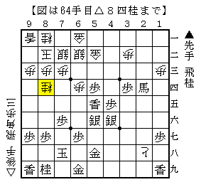

# [三間飛車]「急戦」とは何か  

「棋楽会将棋クラブ」に行ってきた。  
知り合いから話を聞いていたのと、あと某所の評判も若干気になっていたのだが、  
今日は何から何までタイミングが悪かったようだ。  
悪い道場ではないのだが、余程の機会がない限り2時間弱かけて行こうという気になれない。  

今日指した将棋から。  
後手三間飛車に対する早仕掛けはプロ棋界では完全に絶滅してしまったように見える。  

この桂は常に嫌味であるが、どう対処するのが正解だろうか。  

  

筆者は▲８八桂と受け、ポチポチと金を作って攻める順に期待したが  
△６三金～△５二歩まで許したのはまずかった。  
後に一段飛車＋△７六桂～△８八角の筋を喰って逆転負け。  

正解は強く▲３五馬～▲５三歩成と攻め合う順。  
先手玉は一見危ないのもの、飛車角だけでは捕らえきれない。  

持久戦でないので、まず一直線の攻め合いから考えるべきだった。  
急戦の原点を忘れていたような気がする。  

（20121125追記）  
どうやら相手の方は大阪でも相当有名な強豪の方だったようだ。  
対局を始める前に相手の名前はちゃんと確認すべきである。  
