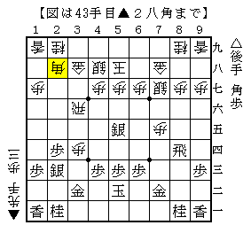

# [横歩取り]屋敷流  

以前将棋世界の棋戦情報欄で△８四飛＋早繰り銀という将棋を見た。  
なるほど新しい屋敷流か、ということでいつか試そうと思っていたのだが、  
今日ようやく試す機会を得た。  

  

図はその中盤戦。  
△７五歩を早めに突き捨てたのがどうだったか。  
△２三銀△２四歩型を先に作り△６四銀～△７五歩の順だったかもしれないが、  
スピード感に欠けるので一長一短である。  
一方本譜のように△５五銀とこちらに出るのもまた不満。  

実戦の▲２八角には△７三角と「角には角」ならまずまずだったようだが、  
実戦は角を手放すのを不満と見て△５四飛。  
しかし▲３三歩成～▲３四歩で二枚替えの筋が受からず不利どころか敗勢。  
なんとか逆転したものの褒められる内容ではなかった。  

図面一枚から真似するということに無理があると言えばそれまでだが、  
思った以上に駒組みに神経を使うし狙いがはっきりしない。  
お蔵入りには至らないが、真似する人が現れないのもなんとなく納得してしまった。  
（そもそも屋敷先生は後手横歩から撤退してしまったのだ）  
