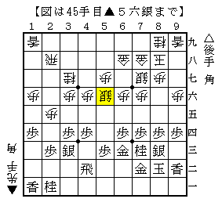

# [角交換振り飛車]やってみたかった

先日書いた修行の件だが、四間飛車を諦めて三間飛車で行こうと思う。  
昔振り飛車を指していた時もどうも四間飛車だけは敬遠していたのだが、  
今になってその理由がより鮮明に分かってきた。  
やはり四間飛車は振り飛車党の中でも王道中の王道の人が指さねばならない。

さて本題。  
以前からいつか真似してやろうと思っていた将棋を立て続けに２つ消化した。

一つは初手▲７八飛からの５手目▲７七飛。  
相手の駒組みが悪く駒がぶつかった段階で圧勝だったが、  
これからも何度か試そうという気にはならず。

二つ目は角交換四間飛車から。  
今期B2の▲藤井△豊島戦で面白い指し方があったのでそれを試したのが下図。

ここから△４一飛▲３二角△９一飛▲２三角成△９五歩▲同歩△３五歩となり、  
難しいながらも何とか攻め切ることができた。

しかしよく見ると、△９一飛に▲８六銀と受けられると難しい。  
△８五歩を入れるかどうか分からないが、  
△３五歩と△１五歩ぐらいで手を作らなければならず大変。  
そして▲藤井△豊島戦を見てみると、▲８六歩と突いてある形でこの受けはない。

なかなか真似だけでは上手くいかないものである。