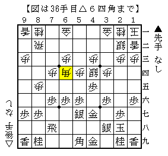

# [ノーマル振り飛車]駒組みの難しさ

ノーマル三間を始めたものの、細かい駒組みで分からないことがここでも多い。

現状真部流とコーヤン流をちょっとずつ拝借している状況だが、  
今思いつくだけさっと並べてみても

・▲４七金と上がるタイミング  
・▲３七桂と跳ねるタイミング  
・端歩を突くタイミング  

の３つがすぐに挙がる。  
三間飛車は繊細なのでこういったところが意外と問題になりやすい気がする。  
もしかしたらコーヤン流持久戦編にそういうことは載っているのかもしれないが・・・

先日指した将棋より。

斜めのラインが開いた瞬間に△８六歩というのは一つの狙い筋だが、  
この局面であれば普通に対応して指せると数日前に確認した。  
なので△３三銀以外は無いと思っていたのだが、これである。

実戦はここで▲３七桂と跳ねたが、普通の真部流では指したくない手。  
▲５九角と引いた手との組み合わせが最悪と言ってよい。  
終盤の検討でもマイナスになることが多く、まるで良いところがない。

代えて▲１八玉と寄って頑張るべきだったか。  
初見ではあまり思いつかない上、かなり指しにくい手だが、  
あくまで▲３七桂と跳ねないという方針であればそうするしかない。  
むしろ終盤当たりから遠ざかる意味ではこの一手のようにも見えてきた。

指しこなせるようになるにはまだまだ時間がかかりそうだ。

（20121226追記）  
▲５九角と引いているので△８六歩でも案外難しいかもしれない。  
▲７七角型だと▲８八飛とぶつけて先手を取ることができるが。。。
