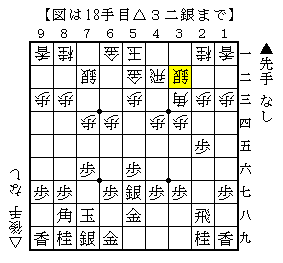
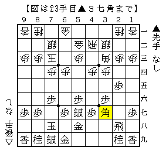

# [藤井システム]没ネタ
先日筆者が考えていたことを記しておきたい。

たまたま眺めていたのが以下の記事。

四間飛車 後手藤井システム△９三歩型  
http://ameblo.jp/shogi-strategy/entry-10949533506.html

△４三銀型＋△９三歩型ではそもそも居飛穴を阻止できないというわけだ。  
ではこれを△３二銀型にすればどうなるか。  
筆者は△３二銀型の方が断然好みなのである。

△９三歩型から△９四歩と突いた図は△９四歩△６四歩型で△７四歩としたものと同一。  
よって△９四歩△６四歩型の対居飛穴と間違いなく合流すると考えてよい。

そこで△９四歩△６四歩型で居飛穴を破れるかがポイントになるのだが、  
正直これは筆者には分かりかねるところである。  
ただし藤井九段が連採されているのを見る限り何かあるはずだ。  
ということで居飛穴は互角以上にやれるということにする。

次いで問題になるのは急戦だが、この形だと▲５五角を△７三玉と受けられる。  
終盤▲７五歩からの直撃がやや怖いが、金銀が形よく残っているのも非常に大きい。  
既存の手順よりも条件が良いということで、互角ぐらいになるかもしれない。

これは新鉱脈発見かと気分良く風呂に入ったのだが、  
湯船の中で▲５五角△７三玉▲３七角の図がもやもやと浮かんできた。

どうにもこれで駄目である。  
△７三桂とも△６五歩ともできないので角のラインを生かしようがなく、  
次に▲６六歩から居飛穴に組むことを阻止できない。

また△４三銀～△３二飛～△４二角として先手の角を狙おうにも、  
▲６五歩～▲７七桂とされて後手玉がいきなりピンチだ。

残念ながら△３二銀型でも△４三銀型と同様の結論となってしまった。
