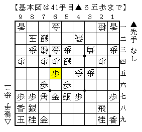
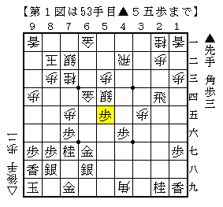
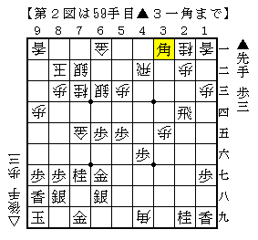
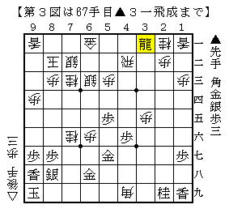

# [居飛穴]スタートラインに立つまで  

前回の投稿で△３二銀型と△４四銀型を考えていると述べたが、  
そう書くと途端に△５四銀型を考えたくなるのが筆者の悪い癖。  

△５四銀型は▲３七角型や▲４八角～４枚組み換えが大きな壁だが、  
それ以前に▲３五歩～▲６五歩の急戦策もかなりの強敵。  
これで駄目ならそもそも△５四銀型自体が潰れだ。  

  

基本図は「四間飛車激減の理由」にも「鈴木大介の将棋　四間飛車編」にも載っている。  
▲７八金型もあるが、△７七角成とされることを考えればまずこちらを考えたい。  

▲６五歩には△６五同桂とする順もあるが、  
できることなら強く反発したいというのが筆者の考え。  
よって△７七角成を検討する。  

  

基本図から阿部健本の手順通りに進んで１図。  
この▲５五歩がどうやら好手。  
鈴木本では▲３四飛だったが、▲３一飛成としても△４一歩で際どく耐えられる。  
飛車を成り込むよりも、金銀をほぐして桂頭を中心に攻めていくのが優る。  

ここで△６三銀と引くのが本手に見える。  
しかし阿部健本の通り進めて、更に第２図となるとどうやら振り飛車が冴えない。  

  

筆者は最初阿部健本の手順最終図では振り飛車もまだまだかと思っていたのだが、  

１）△４六飛は▲５三角成で金取りの受け方が難しく、次に▲２二飛成も残る。  
２）△５二飛は▲６四歩△７四銀▲７六歩△同金▲同金△同角成▲６三金でどうか。  
　　先手玉はまだ遠く、飛車を取れば▲２二飛成で確実に攻められる。  

ということで、どうにも駄目ではないかと考えを改めた。  
よって阿部健本通り△５五同銀と取る方が優る。  
（なおBona先生は△５五同金を指摘したが、良い手とは思えない）  
以下阿部健本での結果図から進めて第３図。  

  

１）△６三歩成は▲同金寄△８八桂成▲同玉△４六飛▲６二銀△４一歩  
　　▲６一銀成△同銀▲６四歩となり、桂頭の弱点もあるので振りほどけない。  
２）ただし単に△４一歩はあるかもしれない。  
　　Ａ）受けるなら▲７九金（銀）で、桂を渡してもらってどうか。  
　　Ｂ）同じ受けるのでも▲７八金は△８八桂成▲同金△６七歩成で、  
　　　　幾らか手を稼げば楽しみがあるか。  
　　Ｃ）▲６四歩から攻め合うのもありそうだが、△６八桂成もかなり怖い。  
　　  
２－Ａはもう少し掘り下げる余地がありそうだが、  
元が駒損なのでそこまで自信がある展開とは言えないのが辛い。  

他にも１つ２つつまらない工夫を思いついたので、  
次回以降でそれについて記したいと思う。  
