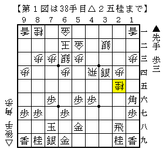
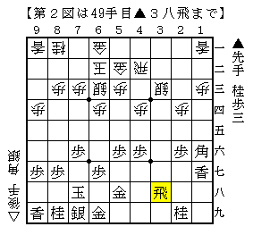

# [藤井システム]捌けてナンボ  

ようやくリアル将棋で四間飛車を試す機会を得た。  
しかしいざ飛車を振ってみると、事前に多少用意しておいた△３二銀型の工夫が  
あまりにしょぼい物に感じられ、後手システムを採用することに。  
王位戦第５局と同様の進行から▲１六角に△２五桂と変化してみた。  

  

以下▲４五銀△４二飛▲２六歩△４四歩▲３四銀△１七桂成▲同香△３三歩と銀を殺すも、  
▲３三同銀成△同銀▲３八飛となり手が止まった。  

  

△３二銀打は▲５二角成～▲３四歩～▲３三金とねじ込まれてまずい。  
よって△３二飛としたが、▲５五桂△５四銀▲５二角成△同金▲２三金で困った。  
以下△４一角から抵抗したものの最後は負け。  

更にずっと戻り△４四歩に▲３六銀と引いても、  
△３七角▲同桂△同桂成▲２九飛△３六成桂▲３一角ぐらいでやはり振り飛車が悪い。  

思いつきで試した△２五桂だったが、△４四歩と打つ手がかなり感触が悪く  
良くなりそうもないことがはっきりした。  
△３二銀型なので飛車が前に捌けないと話にならないようだ。  

（20130524追記）  
「若手精鋭が現代将棋を斬る」でも△２五桂の手順が触れられていた。  
やはり▲４五銀～▲２六歩で切れているようだ。  
