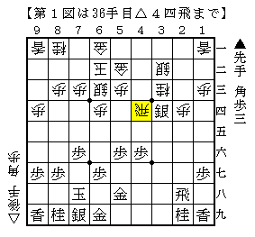
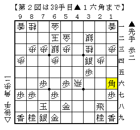
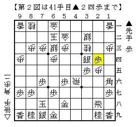

# [藤井システム]何故かといえば  

前回の投稿をした後に何故△２五桂というくだらない手を思いついたか、  
思い出したので記しておきたい。  

  

△３四歩▲同銀△４六歩▲同歩△４四飛と一時下車したのが図の局面。  
ここで▲３五歩ならはっきり振り飛車が得で筆者もそれなりに自信があるが、  
▲１六角としたのが前回も記した王位戦の進行。  

ところで筆者は練習将棋で、△４四飛▲３五歩△４六飛▲１六角  
という二つをミックスした順を指されたことがある。  

  

改めて見ると歩を打った上に飛車成りを受けるだけに角を手放しているので  
かなり変な順であると言わざるを得ないのだが、  
楽勝とばかりに△２五歩とすると▲２四歩が飛んでくる。  

  

辺鄙な垂れ歩だが、案外これが速い。  
通常型なら銀を取られるのでこんな手はないのだが、  
こうなると▲３五歩△４六飛の交換が生きてしまっている。  

というわけでこの場合は△２五桂と止める手が優ると思う。  
今度▲２四歩などなら△４三銀とぶつけて捌ける。  
▲２六歩には△３七桂成～△３六歩でどうか。  

こういうことがあり頭の中で混線して指されたのが前回の△２五桂。  
もっとも碌に掘り下げずに実戦で用いたのは浅はかの一言。  

この周辺は個人的にも興味あるのでもう少し調べたいと思う。  
