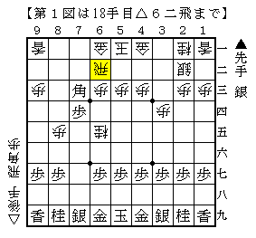
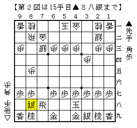
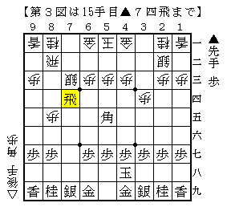
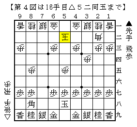

# [棋書]「菅井ノート　先手編」流し読み  

一日そこらで内容を精査できるはずがないのは当然として、  
なかなか見事に感覚を破壊されてしまった。  

筆者個人として特に重要なのは第１章であり、以下の図である。  

  
まさかこの順が再評価されているとは。  
しかし実戦的には依然として後手が厳しいと思う。  
本当に後手がやれるのであれば非常に面白いことになるのだが。  

  
相当な手損だが先手やれるとか。  
角交換振り飛車との垣根の超え方がすごすぎる。  

  
もし本当に先手が指せる将棋なら、  
この古典早石田定跡を精査し直すことも必要なもしれない。  

  
もはや何の将棋かすら分からない。  
ご自身で指した△６二銀～△６四歩もなかなかの手だと思うのだが。  
