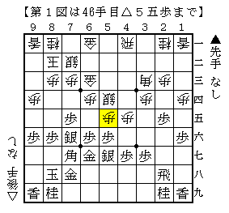
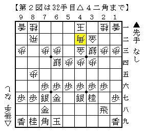

# [ノーマル振り飛車]不慣れ  

どちらかと言えば筆者は指す戦型の種類が多い方だが、  
当然その全てにおいて指し慣れているというわけではない。  

  

ノーマル振り飛車には急戦を多用する筆者だが、中飛車には玉頭位取りを主に用いている。  
しかし普段穴熊左美濃を指していないのに指しこなせるかというと。。。  

図から▲５五同歩△同銀▲２六飛とすればなんということはなかったのだが、  
実戦は▲２四歩△同歩▲６五歩として悪くなった。  
ノーマル中飛車との戦いもいくつか疑問があるのでそのうち触れたいと思う。  

  

横歩取りが居飛車党としてのバックボーンであるため、  
２手目△８四歩に対しては確固たるスタンスというものが一切無い。  
そこそこの間相掛かりを用いていたが、ここ最近は矢倉に目が行っている。  

図は有段者同士ではなかなか現れないような局面だが、  
　５手目▲７七銀を選ぶ→後手左美濃にする→それを見て急戦に  
　　→対して△６四銀を急ぐ→ならば急戦を止めて駒組み勝ち狙い  
というオーディブル合戦の末にできた物であり、一応理由はある。  
ここから当然▲５七角として△７四歩～△７五歩に▲６五歩を用意すべきで、  
それで作戦勝ちだったと思われるのだが実戦は▲６八角。  
序盤派としてはありえない失着だったように思える。  
