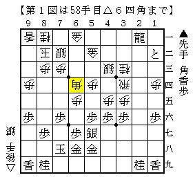
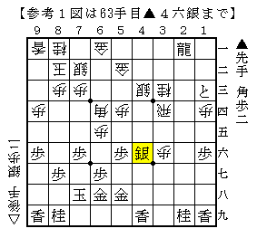
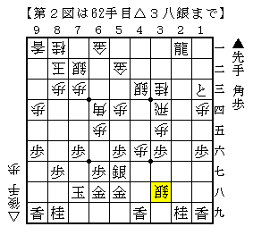
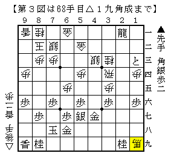

# [棒銀]新たな課題  

図は四間飛車対棒銀のよくある局面から△６四角としたもの。  

  

旧来△３六歩や△５五歩で先手良しと言われていたが、  
高野先生が自著で発表したのがこの新手。  

これがかなり有力で困ったのだが、▲１三と△４六歩▲４九香という受けがあった。  
なかなか思いつかない下段香だが、どうやら好手に見える。  
以下△３六歩▲４六銀と進んだ図は先手がやれるだろう。  

  

四間飛車 先手棒銀  
http://ameblo.jp/shogi-strategy/entry-11033171060.html  

ところが先日指されたのが▲４九香に△３八銀！  

  

露骨すぎる銀なので何とかなると思ったが、案外うるさい。  

実戦は▲４六銀△４九銀不成▲３五銀△５八銀成と進んだが、これは駄目。  
Bona先生も旧式GPS先生も▲４六香だが△４五歩▲２三と△４六歩▲３三と△同飛  
と進んで次の手が難しく、先手を持つ気がしない。  

となると残るは単に逃げる▲４八香だろう。  
以下△４七歩成▲同香△同銀成▲同金△１九角成が一例。  

  

やはり先手自信ないかなあ、という気がする。  
