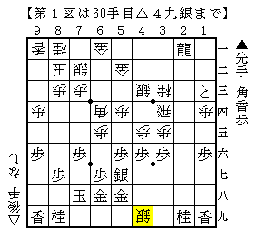
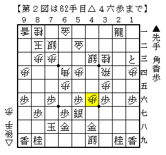
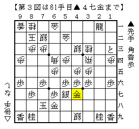

# [棒銀]異筋の銀  

前回紹介した棒銀の将棋だが、△３八銀のような異筋の銀打ちが案外出現する。  
以前指摘されたのは▲１三とに△４九銀！  

  

矢倉にならともかく、舟囲いにいきなり銀をひっかけるのは初めて見た。  

対して▲４八金が自然に見えるが、これはハマり。  
△４六歩と取り込まれると△４五桂や後の△４七歩成が厳しく後手圧勝の流れ。  

  

正解は一見冴えない▲４七金。  
何か手の有りそうな感じのする金上がりだが、案外これが最善であるようだ。  

  
