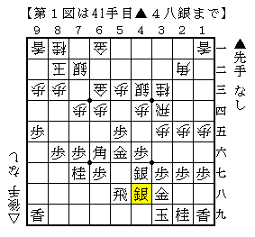
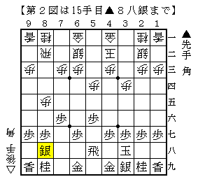

# [中飛車]お試しコース  

気になる形があったのでここ数日初手▲５六歩を試してみた。  

  

まさか将棋世界の付録になるとは思わなかったコバケン流。  
以前C1で▲小林△脇を見た時には「変な作戦やってるなー」程度の感想だったが、  
その翌月将棋世界の棋戦欄で先手作戦勝ちと紹介され驚いた記憶がある。  

実際やってみると組み切れればかなりしっかりしており十分戦えるが、  
それまでに戦いになるとやや辛いという印象。  
高田流左玉と同じで組み上がるまでに手数がかかるのがネックなのだ。  

９割の相手が▲３八銀～▲４七歩に△３六歩から一歩切ってきたが、  
やはり一歩持たれると何かしら動きやすい面があるのは否めない。  

  

実利こそ全てだ！と言わんばかりの前田祐司流。  
思えば佐藤九段や藤井九段も先手向かい飛車で２手損からの仕掛けを披露していたか。  

今のところやられたことはないが実際やられたら大変だろうということで  
先回りして対策を聞こうと思ったのだが、一度もこの形になることはなかった。  
前例の△６四歩～△６三銀型はなんとなくダサい感じがするので  
もう少し何かこれという形が見つかればよいのだが。。。  
