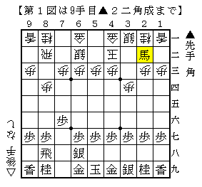
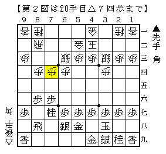

# [角交換振り飛車]２手損の成否  

前回の投稿で２手損の仕掛けが云々と書いた時、  
ふと思い出した将棋があったのでメモ程度に記しておく。  

初手から  
▲７六歩△８四歩▲７七角△３四歩▲８八飛△６二銀▲６八銀△４二玉▲２二角成  

  

前回ちらっと書いた佐藤・藤井流の２手損向かい飛車は  
「▲５六歩と△５四歩は振り飛車側にとって得な交換でしょ」  
という主張だと一応理解できる部分があるが、これだと居飛車の形を限定できていない。  
純粋に近い２手損になっているように見える。  

そしてそこから１０手ほど進んだのが下図。  

  

ここで早くも▲８五歩！と仕掛けたのも驚きだった。  
果たして研究なのか、それとも△６三銀△７四歩を急いだ駒組みが研究になかったのか、  
感想戦を聞けなかったので詳細は一切分からず。  

以下△８五同歩▲同飛△８四歩▲８八飛△９四歩と進み、  
▲６六角△４四角とお互い急所のラインに角を打ち合ったり  
玉形を整備したりと非常に難解な将棋に。結果は居飛車勝ち。  

結構強引に見える作戦だが、果たしてこれはアリなのかどうかよく分からない。  

ちなみにこの将棋の先手はアマ棋界有数の角交換振り飛車の強者Iさんで、  
勝てば公式戦アマ代表枠獲得の大一番。  
何が何でも自分の得意な形で戦おうという意図は当然あるとは思われる。  
