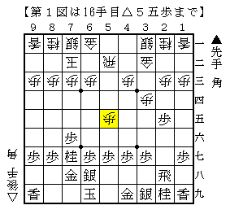
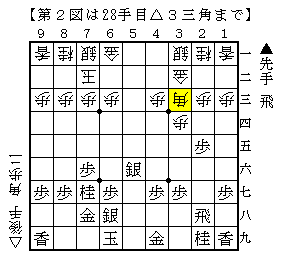

# [中飛車]中飛車対策考  

四間飛車対棒銀をまとめると言ってから結構経つが、  
まだはっきりしない部分があるのでもう少し先延ばしにしたい。  

・▲７八金型  
▲７八金型において３九の銀を動かさずに駒組みを進めるのが  
既に何代目なのか誰も分からなくなってしまった山崎流。  
例の△３三角からの馬作らせ作戦はこれがあって消えたと個人的には思っている。  

そこで▲７七角に角交換するのが振り飛車側の新しい指し方だが、  
▲４八銀が遅いのを突いて△５五歩といきなり突いてくる指し方を先日された。  

  

次の△５六歩を受けるのであれば▲２四歩～▲２六飛だが、  
これはバランスが良くない上に後に２筋逆襲の当たりが強すぎる。  
かと言って他の受け方が分からなかったので実戦はそう進めたが、  
あまり良い駒組みにはならなかった。  

後日思いついたのは▲４八銀△５六歩▲同歩△同飛▲６六角とする指し方。  
△３三角とするぐらいだが▲５五歩△同角▲５七銀右△６六角▲５六銀△３三角でどうか。  

  

持ち飛車は大きいが歩損で７七の桂がやや負担か。  
これはこれで一局だと思うが、もっと良い対抗法がありそうな気がする。  
