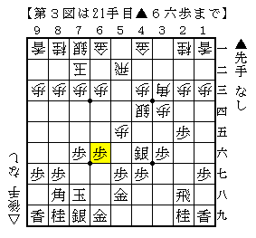
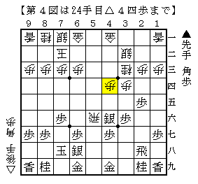

# [中飛車]中飛車対策考２  

・超速▲３七銀  
超速▲３七銀のセールスポイントは△４四銀型に対して持久戦に持ち込める点。  

  

しかしながらここからの相穴熊は先手玉の方が薄く、  
言うほど先手が勝っているわけではない、というのが筆者の印象だ。  

また▲６六歩を突かない指し方もあるが、  
B1の▲飯塚△阿久津にしてもそうだが先手が打開に苦労しているように見える。  

そういう事情もあってか超速▲３七銀を選んでおきながら  
▲７七銀～▲６六銀の急戦策の方がここ最近ではよく指されている。  

しかし筆者が以前から疑問に思っていたのだが、  
それを選ぶのであれば超速▲３七銀でなくてもよいのではないか、ということ。  
ノーマル▲３七銀と比べて振り飛車側の変化の余地を増やしているだけのような気がするのだ。  

菅井流△４四歩であったり△３三角保留型、居玉△５四銀型はノーマル▲３七銀なら現れない。  
それでも超速▲３七銀が指されるのにはどういう理由があるのだろうか。  

なおノーマル▲３七銀にも特有の変化は少しながらある。  

  

68期A級▲森内△谷川でも現れた図だが、これは非常に難解。  
▲３三角成を△同銀とするのは居飛車良しが定説なので困らないのだが。。。  
