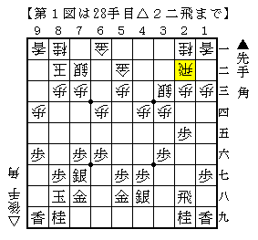
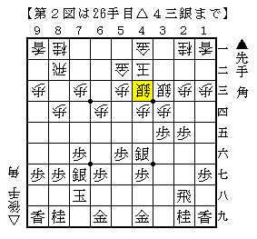

# [一手損]一手損への離陸  

横歩取りにやや飽きてきたこともあり、幾つか他の分野へ手を出している。  

・角交換四間飛車  

  

図はB1▲井上△久保より。  
藤井流のKK4もあるが、個人的に気になっているのはこちらの方。  

・４手目角交換  

  

竜王戦で惨敗した形だが、その後の丸山先生の将棋を見ていると興味が湧いてきた。  

そして糸谷本が主張するように実際に指して追体験してみると  
思いの外糸谷本の内容に関して疑問点が多数浮上してきたので、  
それを一つずつ潰していこうということになったのである。  

ということで気分次第ではあるが、横歩取りへの興味が戻るまで一手損を調べたいと思う。  
