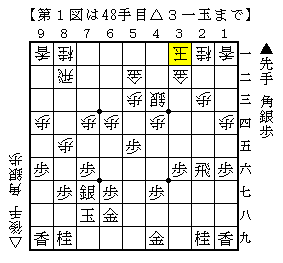

# [一手損]一手損への疑問  

一手損そこそこ試しましたが止めました。  
とは言えやってみた事自体は確実にプラスであり、  
いくつか疑問が出たのでそれを記しておきたい。  

・腰掛け銀はどういう形を目指しているのか  
当然▲２五歩△８四歩型の準同型にする理屈は先手側にはないので  
何かしら別の方向性が必要になるのだが、それが全く見えない。  

糸谷本では「感覚的な将棋となる」とあるが要は力戦になるということであり、  
つまり何かしらの形の優位性を以って戦うということではなく  
自身の角換わりセンスを全面に出すための戦型であると言い換えることもできる。  

どちらかと言うと筆者の目指す方向性とは違うようだ。  

・どちらが得か  

  

図はB1▲畠山鎮△丸山より。  
糸谷本出版後に指された将棋であり、丸山新構想である。  

居玉で駒組みを進めることにより△８四歩～△８五歩が間に合っており、  
▲３五銀を△同銀と取らなくてはならないという状況から脱している。  
それによって手順に３筋の歩を伸ばされず、３三ではなく４三の銀が残ることで  
先手の３筋攻めがかなり緩和されていることが分かる。  

一方で２筋の歩を切られているのはマイナスであり、  
本来であれば歩切れの先手が一歩持っているのはそれは間違いなく後手のマイナス。  

個人的には３五に歩が伸びているのが気に喰わないので丸山流を採用したが、  
逆に先手を持って通常版をやられてみるとそれはそれで嫌な部分があったので  
意外とどちらが優るかは難しいのかもしれない。  
