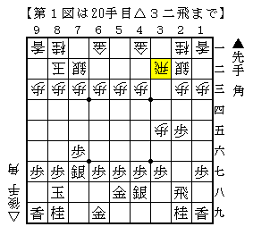
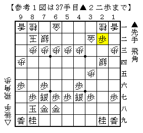
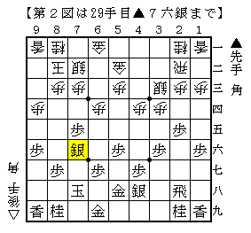
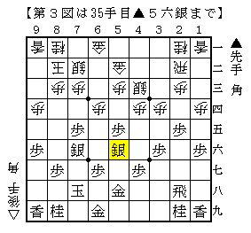
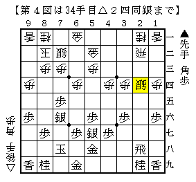

# [角交換振り飛車]藤井になれず  

今日は振り駒４回中４回後手という日だった。  
一手損を止めた以上横歩取りに回帰するのが普通だが、  
何故か気が向かなかったので２局ほど角交換四間飛車を採用することにした。  

・１局目  

  

▲５八金右が早かったので升田式にスイッチ。  
▲２四歩には△同歩▲同飛△３一金で△３三銀～△２二飛の予定。  

実戦は升田式に組ませてくれたので△３三銀～△２四歩の筋が炸裂。  
端から暴れられたものの何とか対処して快勝でした。  

ところで△２四歩から飛車交換した後▲４一角と打つ筋は  
どの棋書でも結構詳しく書いてあるものの、  
シンプルに▲２二歩と打たれた場合どうするのが最善なのだろうか。  

  

単に取ってもそれほど悪くなさそうだったので実戦もそうしたが、  
<del datetime="2013-05-23T14:35:45+09:00">帰って手持ちの棋書に当ってみると一切触れられていなかったので</del>  
ちょっと気になった次第。  

（20130415追記）  
戸辺先生の４→３戦法の本に載ってました。  
取ってしまって良いそうです。  

・２局目  

  

▲５六歩を突かせているのでまずまずかとは思ったが、  
ここから更に△１四歩～△４二銀～△４三銀としたのはあまり良くなかった。  

  

こうなってみると振り飛車側だけ価値の高い手が残されていない。  
△３三桂は▲３五歩からポンポン突き捨てられて▲３八飛がありまずい。  
まだしも△６三金～△５四歩で一歩持つぐらいだが、  
具体的な打開の筋が見えなかったのと△４三銀が孤立していてダサく見えてしまった。  
実戦はここで△３五歩と暴発して以下良いとこなく負け。  

後で考えてみると、△２四歩から逆棒銀に出るのが正解ではないかという気がした。  
ふと田丸先生のブログで見た▲田丸△永瀬の局面図が思い出されたからだ。  

  

タイトル保持者、Ａ級棋士と同室になった永瀬拓也五段との対局 - 田丸昇公式ブログ　と金　横歩き  
http://tamarunoboru.cocolog-nifty.com/blog/2012/10/post-7f2a.html  

▲田丸△永瀬のこれで成立するのだから本譜はより条件が良い。  
正直逆棒銀はこの上なく効率の悪い印象で良くなる気がしないのだが、  
この場合は離れ駒もあり動いていくべき局面だった。  
▲５五歩など何か動いてきた際に△４三角がぴったりすぎる。  

角交換四間飛車が有力であることに対し  
藤井先生などの将棋でも見られた「ナチュラルに作戦負けに陥っていた」という状況の怖さ、  
この両面を感じ取ることが出来た将棋だった。  
