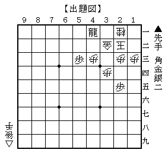

# [その他]詰将棋  

ひと月ほど前に道場で詰将棋を出題された。  

  

「○下○い○う　第１１番」  
と子供の字で書かれたタイトルを見た瞬間に「やってられっか～」と思ったものだが、  
居合わせた小学生が１５分ほどで解いてしまったのを目の当たりにしたことで  
これは筆者もやらざるを得ないと取り組んだところ、  
怪しいところはあったものの１時間弱ほどかかり解くことが出来たのだ。  

こうなってみると筆者も調子が良いというかいい加減なもので、  
こんな３０手弱の問題が解けるのであれば１０手代の問題も解けるだろうと  
今まで解いては投げ出しを繰り返してきた詰将棋本を再び手に取ったのであった。  

そんな訳で今回やったのがこれ。  

[asin:4340071099:detail]  
１０年以上前に筆者が初めて買った棋書である。  
当時初心者に毛が生えた程度だったので当然解けるわけもなく  
長らく押入れの中でお蔵入り状態であった。  

２年ほど前にそれを引っ張り出してきて解いてみたが  
精々９手詰までが限界で２００問中１２０問程度でストップ。  
それを今回ようやくやり切ったわけです。  
（と言えども１問だけどうしても解けないものも有りました。入玉型１５手）  

さてこれで気持よく先日出た「凌ぎの手筋２００」を購入して・・・  
というわけにもまだいかず、まだまだ後ろには何冊も順番待ちが居るわけです。  

[asin:4340071129:title]  
同じ原田先生のこれや、  

[asin:4422751263:title]  
[asin:4415305784:title]  
高橋先生のこれ（他にも３手必死問題集なんてのもあったなあ・・・）  

[asin:4537016108:title]  
[asin:480691505X:title]  
なかなか感覚が合わず苦労する大山先生のこれ、  

[asin:434007103X:title]  
必修と銘打っている割に１桁手モノが３割ちょっとしかないこれ、  

他にも将棋世界付録、必至問題集などずらずらと。。。  
今年中にやり終えることができるかどうかも怪しいものである。  
