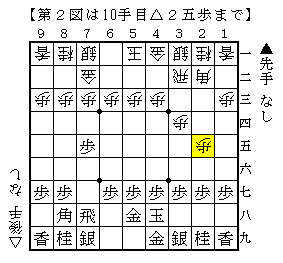
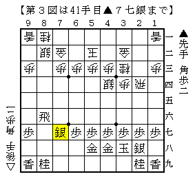
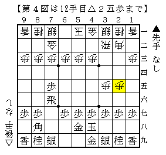

# [石田流]対策としての相振り飛車  

石田流対策は相変わらず難しい。  
△８四歩～△８五歩を主に採用してきたが、玉が薄いことは否めない。  
他に４手目角交換～△５四歩は有力だが、  
▲６八飛から相振りとなると一応後手不満がないが意外と身動きがとりにくい。  

ということで久々に相三間に目を向けることにした。  

  

流行形はここから▲７六飛だとか▲７二銀だが、  
前者はともかく後者は後手が面白くないと思う。  

  

４手目△３二飛からこのように進めるのが一つの構想。  
角交換～向かい飛車～早繰り銀というシンプルな狙い。  
ただし３筋が伸びていないので確実に７筋は切られることになる。  

  

このような中住まいも視野にいれるような将棋になるのかもしれない。  

  

元々は先手を持ってこのような将棋を指されたというのが元ネタ。  
これはこれでひとつの作戦だが、角道を止められた際の指し方であるとか、  
△３五歩と突いている分早繰り銀がないことを考慮すれば一長一短。  
