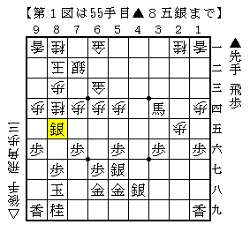
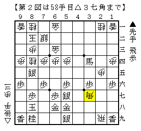
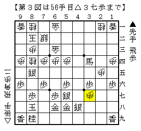

# [早仕掛け]藤井になれず２  

角交換四間をやっているとノーマル四間もやってみたくなるから不思議なもの。  
ただしやはり２４の３０秒将棋ではやりにくく、  
道場の２０分３０秒という考えられる持ち時間の下でのみ指している。  

以前検討していた居飛穴急戦対策は相変わらず放置したままだが・・・  
それは指された時にまた考えることにしよう。  
角交換四間はまだ大会で投げてもいいかと思えるような球種だが、  
さすがにこちらはそうとはいかないのが現状だ。  

今日やられたのは▲４五歩早仕掛け。  
先手を持ってやる気はしないが、後手を持ってやられると面倒である。  

  

△４五同銀に▲同桂とした将棋。  
図の局面では先は長いものの振り飛車が指しやすい。  
しかしここからの３手が相当良くなかった。  

  

△２九飛はまあともかく△３七角は悪手だった。  
▲６九金と引かれてこの金銀を崩しようがないし、この角自体も働かない。  

そこで名著「四間飛車がわかる本」を参照すると、  
△３七歩！という手が記されていた。  

  

早仕掛けにおける「この手だけは指したい」一手である。  

＞「銀多伝にしたら絶対この手をどこかで指してやろうと思わないといけません」  
http://www.sho-gi.net/dousyourenn-komaoti-2mai-8.htm  
