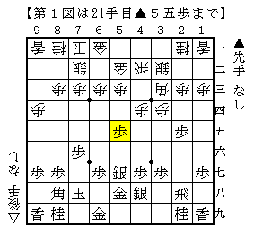
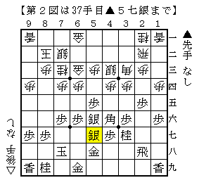
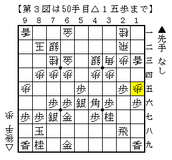
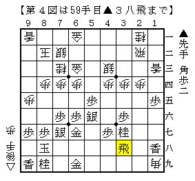
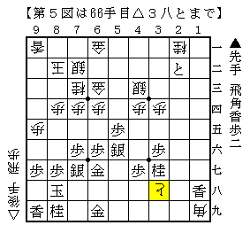
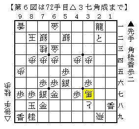

# [５筋位取り]藤井になれず３  

昨日は隣町の道場に。  
知らない少年相手に四間飛車を試す。  

  

ん？  

  

ああなるほど（笑）  
しかし四間飛車歴一ヶ月の人間にそれやりますか。。。  

  

かなり無理気味だけどここから打開。  
タイミングとしてはこれがラストチャンスのはず。  

以下長手数だが  
▲２四歩△同角▲同角△同歩▲１五歩△１八歩▲同香△１九角▲３八飛  
（恐らく▲２四歩よりも素直に同歩同歩でより悪かった）  

  

△２五歩▲１四歩△２六歩▲１三歩成△２七歩成▲２二と△３八と  

  

この局面はそこまで自信があったわけではなかったが、  
そう思っていたのは筆者だけだったようで。  
（そもそも飛車の取り合いにならず▲６八飛とされ全然だと思っていたのだが）  

更に進めて  
▲４一飛△５二銀▲２一飛成△２九飛▲７八金△３七角成  

  

こうなればと金が遅れる形なのでやる気が出てきますな。  

なお実戦は少年特有の鋭い終盤の勝負手に対応を間違えて逆転負け。  
終盤でやられるのはオジサンの常なのです。  

ところでこの戦法の対策を探していると以下のサイトに当たった。  

四間飛車の散歩道 No.16 Ｂ級戦法の達人プラスの真実ー対藤井システム猫だましー  
http://www.geocities.jp/ryuenan/shogi/walk16.html  

相穴にするのは居飛車の角銀桂が絶好の配置でやや作戦負けだと思うので  
△４一金型とやらを検討してみたいのだけれども、  
どのように「穴熊には組めず通常の５筋位取りになりそう」なのかよく分からず。  
