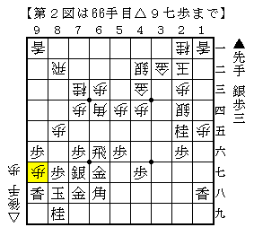
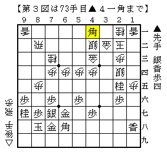

# [矢倉]そういえばあれって結局どうなった  

柄にもなく相矢倉▲４六銀▲３七桂の△９五歩型の話です。  

・宮田新手～▲６五飛と回る形  

  

矢倉９１手組以降に銀冠作戦は指されることがある一方で、  
こちらはそれ以前もそれ以降も順位戦等の中継で見た記憶が全くと言っていいほど無い。  

ここから△９六歩▲同歩に△９七歩と垂らす順もあるが、  
△９八歩～△９七歩と連打するのが古くからあるテーマ図。  

  

「矢倉の急所」や「これで矢倉は指せる」で解説されているのは下図。  

  

>>  
森内本「先手戦える」  
木村講座「ほとんど互角と思う」  
<<  

互角だったらもうちょっと指されてもいい気もするんだけどなあ。  

対してアマチュアだと時間も短いし色々気にしながら指さないといけないので  
実戦的には後手持ちもあるかな、という気もしなくもない。  
（なお筆者は１月ほど前にこれやられて惨敗しています）  

ちなみに先日見つけたのがこちら。  

所司七段ブログ - 竜王戦６組一回戦高見泰地四段戦  
http://c--s.jp/blog/index.php?UID=1356458466  

ほぼ同じ将棋。全く指されていないわけでもないようです。  
そしてありがたいことに解説手順が実に豊富。勉強になります。  
