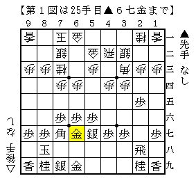
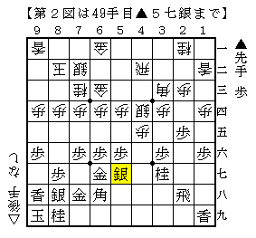
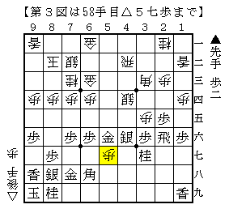
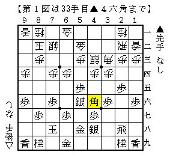
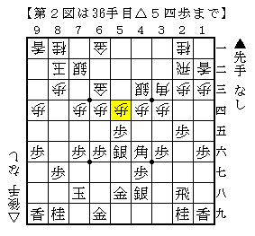
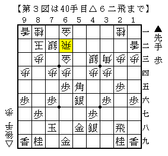
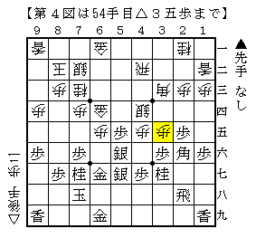

# [居飛穴]藤井になれず５  

居飛穴対策は△３二銀型をメインに考えているが、  
例によってその時の気分が最も大きな要因である。  

  

▲６七金が早かったのでなんとなく△４四銀型にスイッチ。  
単に▲２六角型がなくなったというだけなのだが。  

阿部健本を見ていると▲２六角型が面倒くさく思えて仕方がない。  
「一歩持って３四・４五・５三を負担にする」というコンセプトが実に合理的。  
複数箇所攻められると受け切るのは困難だ。  

  

そんなこんなで▲６八角型に。  

・・・困ったことに筆者はこの戦型はまだ一切勉強していない。  
どういう風に待てばいいのかも分からないので△３五歩▲２六飛△５五歩と仕掛けた。  
なんか無理って言われてたような気もしたので気は進まなかったが。。。  

  

直前までは定跡通り。  
そしてこの△５三歩が筆者のひねり出した一手。  
▲同銀・▲同金は△５五銀、▲同角は△５五歩のつもりだったが  
実際のところそこまで大した手ではない気もする。  

実戦は何故か相手が取らなかったので５二にと金ができて快勝。  
まあいい機会になったのでこの周辺も勉強することにします。  

（20130507追記）  
▲６七金が早ければ▲２六角型が無いというのも厳密には誤り。  
最初から▲２六角型を意識していればこの順を避けるだろう、  
という程度の話でしかなかった。  
この辺りも依然として勉強不足です。  

*p2*[５筋位取り]藤井になれず４  
[http://d.hatena.ne.jp/urawaza3000/20130421/1366559632:title=先日の記事]の相手の方に再び四間飛車をぶつけてみる。  

  

あれ、あなたもこれですか（苦笑）  
「B級戦法の達人プラス」ぐらいにしか載ってないはずなんだけど。  

  

今回はここから反発。  
尤もこれは直前の▲６六歩が疑問で、▲３七桂とすべきだった。  
今度△５四歩から銀をぶつけるのは４三の地点が開いているのでさすがに無理っぽい。  

  

上図から  
▲６五歩△５五歩▲同角△６二飛  

こうなれば振り飛車まずまずのような気はする。  
実戦はその後駒組みが進んで下図となり戦いに。  
とにかく駒をぶつけていけばよいので振り飛車側の方が気楽。  
今度は勝ちました。  

  

（20130506追記）  
柿木七十五号に収録された内容も本投稿と同様の見解でした。  
そして穴熊に組んできたら銀冠～端棒銀という対策も・・・  
七十五号の収録内容から行けば四間飛車道場の△１二香の巻だろうか？要確認。  
