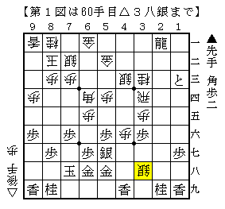
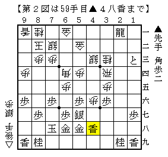
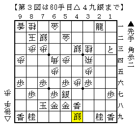

# [棒銀]そろそろ棒銀の話をしよう  

強豪の方に見解を伺い、それをまとめると言ってから早数か月。  
正直それ以降一歩も具体的な研究は進んでないわけだが、  
せめて現状の認識ぐらいは記しておきたいと思う。  

  

これが課題図。  
この△３八銀にどう対抗するか、もしくはその直前の▲４九香を修正するかが問題。  

結論から言うとこれでも居飛車が悪くない。  
ただし振り飛車側に選択肢を与えている可能性もある。  

対して修正案が以下の図。  

  

何のことはない、香車を一段上から打って△３八銀を避けただけ。  
ただしこれは△３六歩が見えているので机上の研究ではやりにくい。  
更に筆者は筋悪流その２とも言うべき△４九銀！という手が見えてしまった。  

  

これもまた酷い筋悪・・・  
創造力・想像力が著しく欠乏している筆者にしては浮かんだだけマシと言う手。  

この修正案は元の課題図より優っている可能性がそこそこあると思われるが、  
まだ断定するには至っていないというのが現状だ。  
