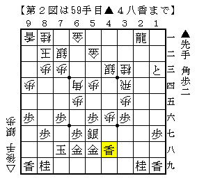

# [棒銀]そろそろ棒銀の話をしよう３  

今回は▲４九香の安易な修正案▲４八香について。  

  

対して検討したのは前述の通り  
１）△４九銀  
２）△３六歩  
の二つ。  

１）△４九銀  
恐ろしく筋悪だが、案外初見では対応が難しいのでは。  

ただでさえ船囲いなのにボロっと金を一枚剥がされるのは嫌なものなので  
▲５九金とかわすところから考えたくなるが、△３八銀不成が嫌味。  
放っておくと△４七歩成なので▲５八金上とするが、再び△４九銀不成で困る。  
かと言って▲５九金寄とするのは当たりが強くやりにくい。  

正解はボロっと剥がさせる▲４六銀。  
香車を打った以上はとにかく▲４六銀と出て前線で押え込むのべきなのだ。  
以下想定される順は  
▲４六銀△５八銀成▲同金△４五歩▲３五銀  

  

こうして見ると玉周辺は少し離れたところに金が１枚居るだけで薄いどころではないが、  
しかし全く手がかかっておらずまだ安全といえば安全。  
対して振り飛車側はと金を寄せられ駒を剥がされていく一方で忙しい。  

これは筆者よりも数段卓越した大局観であり、  
指摘を受けてなるほどと強く感心したものである。  

２）△３六歩  
こちらがある意味本線。  
このような当たりを避けるためにも「下段から香を打て」という格言もある。  

こう指されて非常に感触が悪いためそれだけで▲４八香という手を却下していたが、  
これも▲４六銀と出てどうか。  
▲４六銀△４五歩▲３五歩△４四飛▲５七銀△３七歩成▲同桂△同角成▲２三と  
が想定される順。  

  

桂を取られそうだが、これをあっさり取らせてこちらもと金で拾いに行く。  
▲３三とまで実現すれば銀も拾えるので釣り合いは取れている。  

一応これも先手やれるということになったのだが、  
これについても実戦で試してみないことにはまだなんとも言えないという認識だ。  

結局▲４九香における△１九角成の変化と  
▲４八香における△３六歩の変化どちらがマシか、ということになる。  

こうして改めて見てみるとやっぱりなんとも言えない感じで  
最初に掲げた結論、即ち検討時の結論はどうなのかな、  
というように印象も変わっているが、  
その辺りは時間の経過並びに実戦待ちということで勘弁して頂きたい。  

*1368587376*[棒銀]そろそろ棒銀の話をしよう２  
大したことない内容にも関わらず大風呂敷を広げてしまい、  
頭を抱えるのは何度目だろうか。。。  

  

前回示した△３八銀の図を再掲。  
[http://d.hatena.ne.jp/urawaza3000/20130228/1362070760:title=以前の投稿]で触れた応手は  
１）▲４六銀  
２）▲４八香  
で、その二つを検討した。  

１）▲４六銀  
前述の通り  
▲４六銀△４九銀不成▲３五銀△５八銀成▲同金（△３五飛▲同歩）△４五桂  
と進み居飛車が悪い。  

最後の△４五桂が所謂「駒たちが躍動する将棋」の典型。  
多少細くても△３一歩も利くので居飛車が勝つのは相当難しいように見える。  

  

２）▲４八香  
元々△３八銀という手に対し「ショボい手」という評価をしていたので  
あまり気が進まないようであったが、短い時間では代わる手もすぐには出ず。  

よって前述の  
▲４八香△４七歩成▲同香△同銀成▲同金△１九角成を検討。  
▲２三と△２九馬▲４八歩  
で次の▲３三とが残り後手が忙しい、というのがその場の結論となったが、  
ちょっと粗っぽい検討という感は否めない。  
具体的にはわざわざ馬筋を消し、龍の利きに入ってまで桂を取る必要があるのか、という点。  
よく分からない、というのが個人的な現状の認識。  

  

こう延々と書いているが、実は筆者は机上での研究検討はあまり得意ではなく、  
むしろ苦手と言っていいぐらいだ。  
２４をはじめとする実戦で現れた順を一つ潰す  
（もしくは分からないので実戦で試すべき、と先延ばしタグを付ける）  
のが基本的なやり方。  
なのでこれも実戦で試して感触を得てある程度の筆者の中での結論を見出したいのだが、  
どちらを持ってもなかなかこうならないのが難点だ。  
