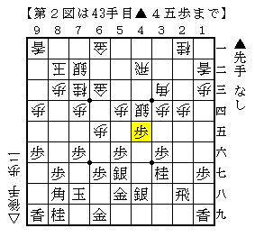
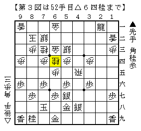
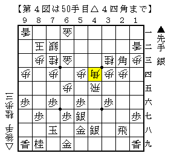

# [早仕掛け]藤井になれず６  

少年に抜かれてしまうのは嬉しくもあり悲しくもある。  
今回の相手の少年も既に筆者よりも強くなってしまった。  
なにせ[http://d.hatena.ne.jp/urawaza3000/20130415/1366023558:title=この]小学生ですから。。。  

  

後手四間飛車対早仕掛けだが、この局面既に先手は４手損している。  
即ち▲３七銀～▲４八銀と▲６八金上～▲６九金。  

ここで△６五歩と△８四歩の２通りの待ち方があり時間をかけて考えたかったが  
この将棋は進行の都合上持ち時間１０分しかなく、えいっと△６五歩。  

  

結局普通に仕掛けられたところでどう対処すべきか悩んでしまった。  
普通は△４五同銀～▲２三角に先手四間飛車でお馴染みの△７五歩だが、  
あいにく△６五歩が邪魔で飛車の応援が利かない形。  
（尤もそれでも成立していてもおかしくなかったが。）  

△６五歩を活かすにはどうすれば、と短い時間で考えた末に辿り着いたのが  
△５三銀～△６四桂の櫛田流。  

  

しかし薄々気付いてはいたが、▲６九金型なので△７六桂と跳ねても響きが薄い。  
実戦も多少迫ったつもりでいてもどうも足りない感じでそのまま負け。  

改めて振り返ってみると▲４五歩は△同銀と取っておいて、  
▲同桂△同飛▲３三角成△同桂▲２三角に△４四角が良かったのではないか。  

  

うーんやっぱりこっちだったなあ。  
早仕掛けでは▲２四歩は△同歩、▲４五歩は△同銀と決めつけてしまおう。  
