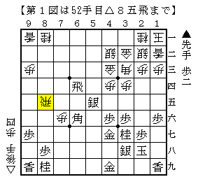
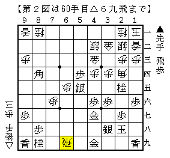
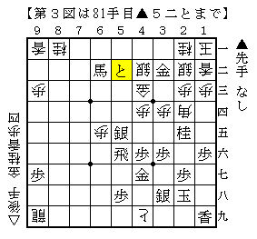

# [居飛穴]藤井になれず７．５  

前回投稿した△４四銀型に▲６八銀の将棋はネット上にも情報が転がっているので  
勉強ついでに拾った分をメモしておきたい。  

四間飛車 松尾流居飛車穴熊 対 △４四銀型02 櫛田流周辺  
http://ameblo.jp/shogi-strategy/entry-11087786788.html  

まずは基本のショパン先生のところから。  
コメント欄の△２五歩▲３三歩成△同角▲３七桂に△４七飛成という手順は  
筆者も以前知人から聞いたことがある。  
これも四間飛車を知らない頃だったので詳細は一切覚えていないが、  
その知人は振り飛車側を持ってなかなか自信がある様子だったのはよく覚えている。  

所司七段ブログ - 棋聖戦櫛田陽一六段戦  
http://c--s.jp/blog/index.php?UID=1176951078  

将棋世界の櫛田付録にも載っていた▲所司△櫛田の詳細な情報。  
前回投稿の「▲６四歩と垂らして勝負した将棋」というのはもちろんこれ。  
71期C2▲大石△石川のコメントにある「△６五歩は先手１勝、△４六歩は後手２勝」  
というデータから見ても重要な局面だということが分かる。  
この記事の内容が今後の組み立ての土台となりそう。  

日本大学理工学部将棋研究会ブログ - 松尾流－番外編その２－  
http://yaplog.jp/cst_shogi/archive/23  

「実は▲２四歩を入れるタイミングってシビアなんじゃね」という面白い記事。  
もちろん通常型に合流する線があるので本筋ではないが、一度試してみようと思う。  
他にも▲６八銀の前に▲８六歩を入れるという将棋もある。  
当然筆者は初見なのでどうすればいいかよく分かっていない。  

かみさまの部屋 - ▲居飛車穴熊　VS　△四間飛車　△４４銀型　その5  
http://www.megaegg.ne.jp/~kamisamanoheya/kininaru/kininaru14.html  

老舗四間飛車サイトでも櫛田流が扱われていた。  
こちらは△４六歩に代えて△３五角。  
△４八角成よりも自陣に利いている分得ではありそうだ。  

しかしここ、トップページの局面図がゴキゲン中飛車・・・  
以前こう変わったのを目撃した時の虚しさったらなかった。  

他にもまだまだあるはず。発見次第適当に足していきます。  

*1368847771*[居飛穴]藤井になれず７  
居飛穴対策は相変わらず気分次第だが、先手だと実質△４四銀（▲６六銀）型一択である。  
△４四銀型を指すと▲２六角型が厄介なのは以前触れた通りだが、  
今のところ多く指されたのは▲６八角型と▲６八銀型である。  

  

今回やられたのは▲６八銀型。  
四間飛車について何も知らなかった頃は何故こんな指し方をするのか分からなかった。  
今は振り飛車が勝手に打開してくれるので仕掛けの心配をする必要がないと理解している。  

図で▲６五歩がもちろん普通の手だが、今回は▲２五桂～▲５四歩の櫛田流を採用。  
友人の四間飛車党強豪はこちらを採用しているのでやってみたくなった。  

  

例の捌きから△６九飛。これもよくある手順。  
以前将棋世界の▲松尾△櫛田の解説で「平凡な▲４一飛では響きが薄い」  
と書かれたことがあるが、現実問題結構これも大変。  

もうこの辺からは事前のお調べも殆どない。  
▲６四歩と垂らして勝負した将棋の図面が記憶にあり▲６二角成～▲６四歩としたが、  
どうやら単に▲６四歩と垂らしたのがその実戦だったようだ。  
現に本譜はと金で金銀２枚剥がせるもののどうもワンテンポ遅く、  
馬の利き・と金・▲５五銀の三者が微妙にダブっている印象。  

  

実戦はこう進んで振り飛車が全然駄目。  
△３九とぐらいで一手一手だったはずだが居飛車側に悪手が三つほど出て逆転。  
勝ったから良かったものの。。。  
