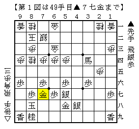
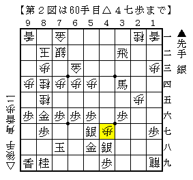
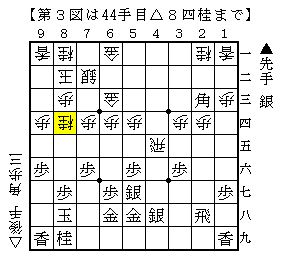
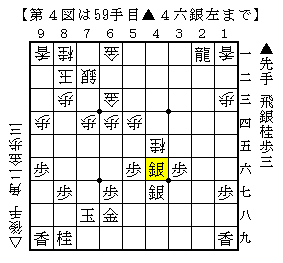

# [早仕掛け]藤井になれず８  

以前にもあった▲６八金型で△４五同銀に▲同桂とする将棋。  
今回は最難関の▲７七金型。  

  

兎にも角にもここでは△４七歩の一手だった。  
▲５九銀に端攻めするにはこのタイミングでないとまずい。  

実戦は  
△７三桂▲３二飛△７一金▲６六歩△８五桂▲８六金△６九飛▲７八玉  
△１九飛成▲４九歩△４七歩  

  

と進んで以下振り飛車勝ち。  
▲３二飛と二段目に飛車を下ろしてしまったので振り飛車玉へ迫る手段に乏しい。  
実戦のようなゆっくりした攻めでも十分間に合ってしまう。  
代えて▲４一飛とされていたらあまり自信のない進行だった。  

そして改めて渡辺本を確認してみると・・・  

  

なるほどこれの方が含みがあって良さそう。  
しかし▲３四角成は大丈夫なのかな？  
以下△７六桂▲７八玉△２五飛・・・というデータが手元にあるが、  
その手順の最終局面が下図。  

  

振り飛車の攻めが細いような。  
実際は難しいのだろうが、試す価値はあるかもしれない。  
