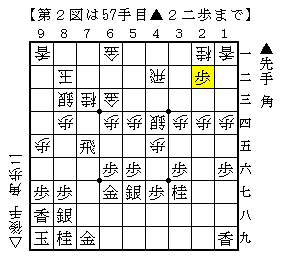

# [居飛穴]藤井になれず９  

大会が近づいてきたので２４でも四間飛車を頻繁に登板させている。  
それに伴い、何でも受けて立つ育成モードを一時中断して  
一部でやや勝ちやすさに軸足を移した戦型選択をすることにした。  

尤も居飛穴対策で勝ちやすい作戦など存在しないのだが。  

  

▲７八飛が無い上に角が逃げられなくなっているので  
通常型とは比べ物にならないほど振り飛車が得をしている。  

そこで欲張って△９五歩と位を取ってみたがこれがどうだったか。  
単純に銀冠に組み換える方が良かったかもしれない。  
どうしても序盤から欲張ってしまう癖がある。  

  

無理気味に動かれたのが上図。  
もちろんこれで振り飛車がまずくなった訳ではないのだが、  
こうなってみると△９五歩よりも△７二金の方が遥かに価値が高い。  

  

更に進んで上図。  
ここで迷って△４九角と打ったが疑問。  
どうせ△２七角成～△３六馬のコースなのだから最初から△２七角が優る。  
実戦は△２七角成の瞬間が甘く、変な喰いつきを許してしまった。  

実戦はこの後７筋でのせめぎ合いの末玉が逃げ出して勝ちに。  
尤も時間があれば寄せ切られていただろう。  

  
