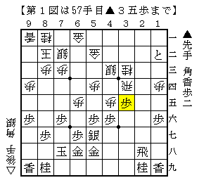

# [棒銀]藤井になれず１０  

これはどちらかというと棒銀シリーズの方が適切かもしれないが、  
四間飛車側を持ってやられたのでこちらにする。  

△６五歩型に▲３五歩とし、後手も△３四歩から反発した例の将棋。  
先手の工夫はもう少し先だと思っていたら突然変化された。  

  

なるほど香車を持ってるのでね。  
△同飛▲３六歩と進むが、それも△同飛と取るとさすがに▲３七香でまずい。  
よって△２五飛に１）▲２六香と２）▲２七香が考えられる。  

１）▲２六香  
一目やりたいのは△２六同飛▲同飛△２五香として飛車を殺す順。  
▲２五同飛△同桂▲６四香が気になるが、△７一金と逃げておいて▲２一飛～▲９五歩には  
△２七飛～△２九飛成と強気に出て▲９四歩に△４四角で何とか耐えているはず。  

  

もちろん先に▲９五歩とする順もあるが、同様にどこかで△４四角があるので受かっている。  
また先の変化では△２七飛～△２九飛成としたが、△４九飛のスピードアップも検討すべきだろう。  

２）▲２七香  
今度は飛車を殺せないので△３九角とするしかなさそうだ。  
▲３八飛と逃げるのは△２七飛成▲３九飛△４六歩でさすがに居飛車が勝てない。  

よって▲２五香△２八角成▲２三香成と進んでどうなるか。  

  

ぱっと見は△２五桂▲３三成香△４四銀だが、どうにも相手し過ぎている気がする。  
我が家のBonaは△３二歩を推奨しているが、  
後手に回って▲３三成香△同歩▲６四桂の筋を与えるのは相当やりにくい順だ。  
ただしこの局面自体は振り飛車持ち、最低でもいい勝負であることに異論は出ないはず。。。  

なお実戦は第１図から△３五同飛に▲３七歩と控えて打ってきた。  
以下△２五桂▲３九香と進んだが、これはあまり上策ではない。  
代わる手段として△４四角やBona推奨の△６六歩（！）など色々あるが、決定打を発見するには至っていない。  
ただこれも局面自体は振り飛車持ち、最低でもいい勝負だろう。  
居飛車側としてはもっと良くする順が存在するはずである。  
