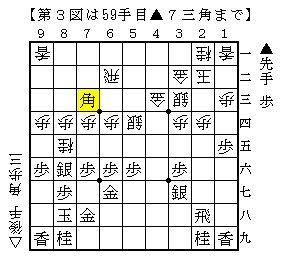

# [その他]藤井になれず　懺悔編  

大会連戦シーズンに突入。  
その初戦、地区予選ながらなかなか健闘することができた。  

・予選（というのは名ばかりで負ければ一発終了）  

４手目△４四歩だったので▲５八金右を敢行。  
△４二銀だったのでウソ矢倉対超急戦棒銀となる。  

うそ矢倉対策としての五手目▲５八金右  
http://www.ne.jp/asahi/golconde/shogi/golmemo002.html  

この作戦はパッと見嘘くさいものの思想的には相当優秀。  
ただし避けられて落ち着いてしまうと先手の得を失ったような将棋になる。  

実戦も△３一角～△２二飛と収められて訳の分からない将棋に。  
仕掛けどころが見つからなかったので、  
船囲い急戦の裏格言「作戦負けなら右玉に」を実践したところ相手が間違えて勝ち。  
７八にいた玉が投了図では２六を経由して１七に居り、２九の飛車の利きが強く詰まないという珍局。  

１０手目時点で１０分消費し、駒がぶつかって程なく片や１０分片や秒読みになったのが実戦的に大きかった。  

・本戦１  

振り飛車党強豪小学生相手なので３手目▲２五歩を敢行。  
端の位をとって銀冠対穴熊の将棋に。  

  

既に千日手模様の探り合いに入っていたのだが、  
△１二香が入っているので様子を見ながらどこかで打開するつもりだった。  
▲２六飛～▲２七飛～▲２九飛という角換わり腰掛け銀でお馴染みの三角パスがあるので  
得になるかはともかく、その気になれば何かしら１手違う局面には誘導できる。  

実戦は▲２六飛を見て振り飛車側から△５五歩と動いたが、これは明らかな暴発。  
▲７五角～▲５五歩～▲２四歩から▲５二歩や▲５三歩を含みに応対してはっきり良くなった。  

振り飛車側としてはやはり△１二香を入れずにじっと待ち、  
千日手狙いにした方が良かったようだ。  

ちなみにこの将棋も最後▲９七玉と逃げた際に８九の飛車の利きが強く詰まなくて勝ち。  
珍しいこともあるものです（笑  

・本戦２  

道場でも数回指している中学生の子と。  
過去に指した将棋は△８五飛が２回と対先手三間の急戦が１回。  

▲７六歩△３四歩▲６六歩△３二飛▲７八銀△６二玉▲２六歩△４二銀▲４八銀△７二銀  

  

△３二飛を見て表情が変わった。やっぱりね（笑  
敢えて石田流に組まないのも実戦的に正解だったと思う。  
位取りから押さえ込まれる展開になるとワンミスで死んでしまうことがある。  
以下は角道オープン三間対左美濃になり快勝。  

「てっきり居飛車党だと思ってました。」  
「まぁ振り飛車党だからね（大嘘」  

ちなみに筆者の超絶個人的な定義では横歩取りは振り飛車。  
居飛車に対する振り飛車ではなく「飛車を振り回す」戦法だから。  
軽薄な人間だから将棋も軽い（苦笑  

・地区代表決定戦  

後手を引いて何を指そうかなあ、と思ったのだが、  
なんとなーく目に入ったのが４三の歩ではなく８三の方だったので横歩取りを目指すことに。  
相手が昨年も地区代表を取っている人だし、棋譜を取ってる将棋なので避けないだろう、  
という根拠のない思いもあった。  

△８四歩▲７八金。  
あっ、嫌な予感。  

△３二金▲６六歩。  
あーあ。  

ここ最近横歩取りを休止してまで四間飛車を始めた理由について  
対外的には「飽きた」ということにしているのだが、  
避けられることが余りに多くなりつまらないから、というのもかなり大きな要因。  

気を取り直して普通の矢倉模様に駒組みが進む。  
幸いにも雁木とか右玉とかそういう手の作戦をやってくる人ではなかった。  
問題はこちらが何を目指すかだ。  
当然急戦矢倉も考えたが、ふと頭によぎったのが次の考えだった。  

「このまま相矢倉になれば加藤流になる。加藤流の工夫を知る方が有意義な将棋になるはずだ。」  

かくして駒組みは進む。  

▲３七銀△６四角・・・▲４六角。  
あーあ。これ準備してねえ。  
脇システム流行ったの相矢倉完全に止めた後の話だったもんなあ。。。  

こうして形勢に差がつく随分と前の段階で気持ちの面で敗勢。  
どこかで見たような脇システム拒否っぽい駒組みにしたものの、下図のように上手く仕掛けられて負け。  

  

あらゆる技を尽くして粘りはしたが、こちらが良かった局面は一瞬たりともなかったはず。  

--------------------  

さてこうして大会での４局を振り返ったわけだが、  
お気付きのようにあれだけ事前に指し込んだ四間飛車を一度も登板させることがなかった。  
それも最後に投げるチャンスが有ったにも関わらず、である。  

まだまだ覚悟が足りていないようだ。ここに懺悔致します。  
