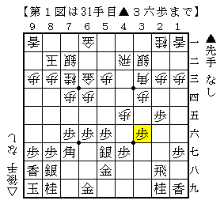
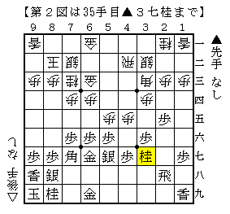
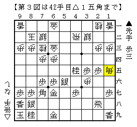

# [居飛穴]藤井になれず１１  

この日曜日にも大会があるので  
四間飛車への覚悟を決めるべく再び２４で四間飛車を指し始めた。  

  

この▲３六歩は早い。  
色んな本に書いてある通り△５四歩～△５五歩として咎めに行った。  
もちろん５筋を切って△５四銀型は振り飛車の作戦勝ち。  

  

こうされて分からなくなった。  
△５六歩▲同銀△４六歩▲４五桂△１五角はまずまずかもしれないが、▲同金の時が問題だ。  

実戦は  
△３五歩▲同歩△５六歩▲同銀△３六歩▲４五桂△１五角  

  

と進んだものの、これは垂れ歩と角がダブっていていいこと無し。  
（尤もその後３七に出来たと金が４七～４六～５六と働き十分仕事をしたのだが。）  

△５五歩と突くのは△４三銀と上がってからの方が良いのか、  
それとも玉周辺に手がかかっているのでやや無理なのか。  
現在の筆者の四間飛車力ではよく分からないところだ。  
