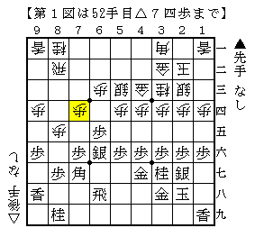
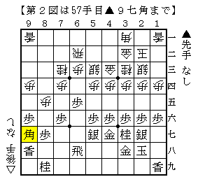

# [左美濃]藤井になれず１２  

先週に引き続き大会。残念ながら準優勝でした。  
諸都合により今回は決勝のみ採りあげることとしたい。  

基本居飛車多用の子が相手だったので初手▲６六歩を敢行。  
相振りにされるとどうかという感じだが、そうでないなら右四間を牽制する意味がある。  
左美濃から持久戦になり迎えたのが下図。  

  

一般的には振り飛車もまずまずの組み上がり。  
ここに至るまでに既に△４二角～△３一角が入っており  
居飛車側は半ば千日手を決め込んでいる。  

しかし直前まで最終盤指運勝負を繰り広げていた筆者には打開方法が分からなかった。  
▲５五歩は明らかに無理をしているので却下したが、さりとて他の手が浮かばない。  
実戦は長考の末▲５七銀と引いた。  

▲５七銀△６二飛▲８八角△７三桂▲９七角  

  

最後の▲９七角が我ながらなかなか意味不明の一着。  
疲れから完全に頭イッちゃってますねこれ。  
△６四歩から普通に仕掛けられて一気に悪くなり以下圧敗。  

改めて見ると▲９七角に代えて▲７五歩があったか。  
△７五同歩は▲７八飛、△８六歩▲同歩△７五歩は▲６六飛。  
せめてこれぐらいは指したかったところ。  

先週の反省に基づき四間飛車を採用したまでは良かったが、  
やはり結果に結び付けるのはなかなか難しいものだと痛感。  
