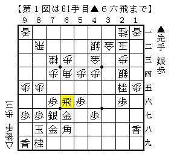
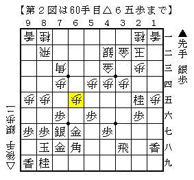
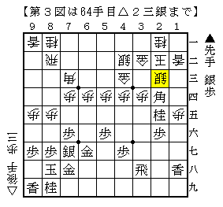

# [矢倉]Ponanza新手の意義１  

既報の通り森内名人の防衛で今回の名人戦は幕を閉じた。  
防衛の原動力となったのは第４局・第５局に現れた  
矢倉における新構想にあるのは言うまでもない。  

そこで第５局に現れた新構想△６五歩～△３七銀（以下便宜上「Ponanza新手」と呼ぶ）について  
そこに至るまでの簡単な流れやその意義について記そうとしたのだが、  
書いてみると案外長くなってしまったので数回に分けて書き直すことにした。  

まずは９１手組前夜までについて。  

そもそも相矢倉の▲４六銀▲３七桂型が△８五歩型と△９五歩型に分かれるのは周知のことである。  
そして△９五歩型において宮田新手▲６五歩がターニングポイントとなったこともまた同様。  

宮田新手の優れた点は直接的には▲６六角という手を作っているところだが、  
その副次作用として▲６四歩と突き捨てることによって新たな攻め筋が生まれた点も見逃せない。  

例えば筆者が以前当ブログで取り上げた▲６五飛～▲６六飛と回る形は  
▲６四歩△同角という交換が入ったからこそ生じた筋であり、  
同じ▲６五歩型を得られるものでも銀損定跡ではそういうことにはならないのである。  

  

この形もかつては随分と流行したようではあるが、現在では最早殆ど見られない戦型になってしまった。  
その経緯について筆者もかなり興味が有るのだが、本稿では主題から外れるので割愛させて頂く。  
ともかく「現状後手が選ぶ価値があると思われていない」わけである。  

では▲６四歩に△同歩とするのはどうか。  
そもそも角筋が止まってしまうので△同歩とは取りにくいと考えるのが自然であり、  
それを敢行する以上積極的な受けという方針は必然的に選択できなくなってしまうのが泣き所。  

まず後手が考えたのは△６五歩からの攻め合い。  
突き捨てられた筋の歩を伸ばすのは極々自然であり、そうすることで角筋も再び通る。  
これで良ければ話が早いのだ。  

  

ところがこれは上手く行かなかった。  
セオリー通り端を攻められてみると、△１四銀や△２四銀と抵抗したところで受け切れない。  
△６六桂といった攻め筋も相当な迫力なのだが、如何せん端を破られてからでは証文の出し遅れ。  
かなり難しい戦いではあるが、先手良しが一応の結論として出されたのでこの形は消えたのだった。  

攻め合って駄目なら受けに回るしか無い。  
即ちたくさん歩を貰ったのでそれを玉周辺に投資しようというわけだ。  
具体的には△２四歩▲同角と角を引きつけて△２三銀と埋めるのが非凡な発想で、  
こうして銀冠を作ることで端攻めを緩和することが出来る。  

  

ではこれで後手も十分戦えるようになったかといえばそうではなかった。  
何せひたすら先手の攻めを受け止め続けないといけないのである。  
ノーマル振り飛車対居飛車穴熊の戦いからでも分かるように  
受け一方というのは一度間違えれば負けになってしまい勝ちにくい事この上ない。  
角筋が通っていれば受けやすさが違ってくるのだが、△６五歩と伸ばしている暇はない。  
▲６四歩の一手がここでも効いている。  

こうして宮田新手の優秀性が広く認められたわけだが、  
対する後手側もそのまま黙って手をこまねいていたわけではなかった。  
次回は反撃の狼煙となった５４手目△３七銀について記したいと思う。  

  
