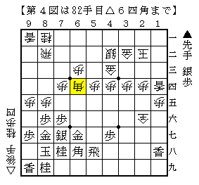

# [矢倉]Ponanza新手の意義２  

棒銀シリーズの時に頭を抱えたことを早くも忘れてしまっているようだ。  
何とか予定ではあと２回、無事書き終えたいものだが  
こういう時に限って四間飛車の面白いネタを発見してしまったりするのだ。。。  

さて今回は５４手目△３七銀の優秀さについて。  

宮田新手の発見から▲６四歩の効果により△９五歩型が窮地に立たされたのは  
前回述べた通りである。  
そこで新たに現れた手法が５４手目△３七銀だ。  

  

△３七銀の狙いは見ての通り、飛車を押さえてしまうこと。  
こうして飛車さえ押さえておけば▲６四歩とされても△同角でなんともない。  
そして△２六銀成（不成）や△２八銀成と先手の攻め駒を取ってしまうぞと圧力をかけることもできる。  
角のライン＋銀の前線でのプレスという組み合わせによって  
前回▲６四歩△同角の項で述べた「積極的な受け」を実現したわけだ。  

この手も前回紹介した形と並行して少数ながら指されていたようだが、  
有力視はされていなかったようである。  
現に森内名人の名著「矢倉の急所」にもこの手自体は載っているが  
>>  
ただ銀が重くなるので、後手を持ってこの変化を選ぶ棋士は少ない。  
<<  
と一言触れただけであった。  

それを発掘したのが△８四歩の鉄人・郷田真隆。  
あの木村を相手にいきなり採用して勝ってしまったことで一気に注目されたのだ。  

ということで５４手目△３七銀の実戦を幾つか見てみよう。  
２０１０年の棋王戦本戦▲高橋△渡辺より。勝てばベスト４で敗者復活権獲得の大一番。  

第１図以下  
▲５八飛△１五歩▲３五角△３四歩▲６八角△２四歩▲１二歩△同香  
▲２四角△２六銀成▲１三歩△同桂▲同桂成△同香▲６八角△２四歩  

  

長手数進めたが見て欲しいのは第２図。  
先手に銀桂を捌かれてしまったものの、飛車は５筋に逸れており  
１筋から３筋まで後手の矢倉城に嫌味が全く無く、上部も厚い。  
（最後の△２四歩を▲同角と取ると△２五成銀と引かれ更に厚くなってしまう）  
こうなってみるとむしろ後手が２一の桂を捌いて攻め駒にしてしまっているとも言える。  

そこから更に進んで第３図。  
遂に切り札の▲６四歩を出してきたところだが。  

  

第３図以下  
△８六歩▲同歩△８七歩▲同金△８五歩▲１四歩△同香▲７八桂△６四角  

  

何とあっさり手抜いて攻め合い。  
嫌味を付けるだけ付けて、自陣に桂を打たせたところで今度は手を戻してしまった。  
こうした指し方が出来るのも後手玉が超安泰だからである。  

桂を打ってしまった先手はこの後必死に手を作ろうともがいたものの、  
的確な攻めをヒットさせ続けた後手を前に為す術無く敗れてしまった。  

もう１局、時系列はやや前後するが２０１０年初めの順位戦Ｂ１▲行方△渡辺より。  
こちらも順位戦終盤上位同士の戦いと重要な対局である。  

第１図以下  
▲３九飛△１五歩▲３五角△２八銀成▲１二歩△同香▲１五香△３九成銀  

  

今度は▲３九飛とこちらに逃げた将棋。  
随分と盤上の実験が重ねられた挙句最終的には▲５八飛よりもこちらが優るとなったのだが、  
それが分かるのもこの対局よりまだまだ先の話である。  

▲３五角と出た瞬間が中途半端なので△２八銀成と圧力をかける。  
飛車が逃げると香車を取られ攻めがなくなってしまうので、  
飛車のラインが生きているこの瞬間に端から殺到していくのがセオリー通りの攻め。  
対する後手は超強気の△３九成銀！  
こうなったらもう収まらない。  

  

更に進んで第６図。一目後手玉は受け切れそうもない形。  
当時の中継コメントでも複数の棋士が受け切れるのか疑問視していたというものが残っている。  

  

更に更に進み第７図。こうなってみるとなんだか難しい雰囲気が出ている。  
実はこの局面は前例があり先手が勝っていたのだが、  
この後何と９２手目！に新手が現れて後手が勝ってしまう。結論は後手勝ち。  
是非とも順位戦中継サイトで見て欲しい将棋だ。  

こうして５４手目△３七銀の再発見により後手は以前よりも積極的に戦えるようになり、  
△９五歩型に於いて主力と言えるポジションを獲得したのである。  
次回は５４手目△３七銀に対する先手の反撃を記していきたい。  
