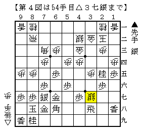
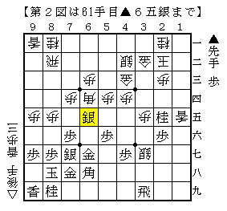
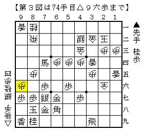
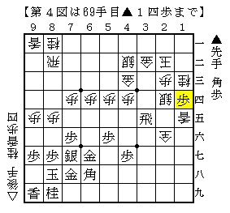
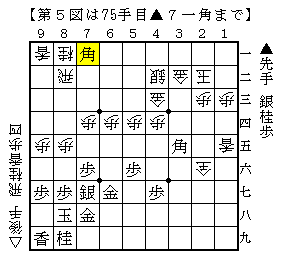
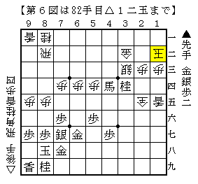

# [矢倉]Ponanza新手の意義３  

驚いたことに森内名人本人が逆を持って指したとのこと。  
このシリーズどう着地すればいいのだろうか。。。  

ともあれ今回は５４手目△３七銀に対する先手の反撃について記す。  

５４手目△３七銀という前線でのプレスにより  
積極的な受けが効果を発揮したことは前回述べた通り。  
これにより一時期後手が随分と白星を稼いだのだが、  
遂に先手側もそれに対抗する新構想を編み出したのだった。  

初めて世に出たのが第２３期竜王戦七番勝負第２局▲羽生△渡辺という超大一番。  
羽生先手矢倉はとにかく不思議なぐらい手が繋がる。  
さながら羽生マジックとはこちらを指すのではないかと思わせるものがある。  

  

再掲△３七銀図より  
▲３九飛△１五歩▲６四歩△同角▲１五香△同香▲６五銀  

  

効果がないと思われた▲６四歩をいきなり利かせ、  
完全にフライングとしか思えない▲１五香！  

これが流石の妙手で、何かの時に▲３五飛と走れば  
次に▲１三桂成～▲１五飛と香車を取り返しながら捌ける。  

こうしておいてから▲６五銀と角に圧力をかけるとにわかに銀が危なくなった。  
角が逃げると▲６四歩と押し込まれて酷いことになるからだ。  
今まで急所だった▲６四歩の突き捨てはこの形でもやはり急所だったのだ。  

この将棋は以下  
△２六銀成▲１三桂成△同桂▲１四歩△３四香▲６四銀△同歩▲４一角  
△１二歩▲１三歩成△同歩▲７四角成△９六歩！  

  

と進み、難解な戦いの末後手勝ち。  

結果こそ伴わなかったもののこの形は非常に注目されることとなり、  
水面下での研究が進んだであろうことは推測に難くない。  

そして先の将棋から４ヶ月後、奇しくも再び▲羽生△渡辺というカードで  
この戦型が現れたのである。それもNHK杯決勝というこれまた超大一番で。  

第２図以下  
△２六銀成▲６四銀△同歩▲３五飛△２四銀▲１三桂成△同桂▲１四歩  

  

角を取って▲３五飛が修正案。  
第３図のように△３四香と打たれると厄介だと見たのだ。  
そして△２四銀には▲１三桂成～▲１四歩と端攻め。  
飛車を逃げていると受け止められてしまうのでスピード重視。  
既に角を取っているので飛車を取らせてもそこまで痛くないのだ。  

  

更に進んで第５図。この角に期待していたのだ。  
後手も飛車を逃げている余裕はなく、△２五成銀として勝負をかける。  

  

更に更に進んで第６図。  
直前の▲３四桂のところで▲７一馬と単に入ったのが  
この１年後に指されたNHK杯決勝▲羽生△渡辺の進行。それも難解な戦い。  

実戦はここで▲７一馬と飛車取りに入り、対する△８四飛が敗着で先手の勝ち。  
正解は△８三飛と１マス手前に逃げる手。  
これでまだまだ難しい戦いが続いていくのである。  
たった１マスの違いで大違いになるから勝負とは厳しいものだ。  

更に時と研究は進む。  
第６図で単純に▲３三馬△同金▲２二金と精算してしまうのが有力であることが発見される。  
そこから▲８二飛△３二歩▲８一飛成となった局面が、かの有名な「矢倉９１手組」の局面である。  

  

さてここまで駆け足で▲１五香の羽生新構想から９１手組まで進めてきた。  
少々内容がややこしくなってしまったが、筆者が伝えたいのは細かい手の意味ではなく  

・先手はとにかく攻め駒、特に飛車を捌こうとしている  
・後手は飛車を押さえながら成銀を引きつけ、上部を厚くしようとしている  

という「どちらも自信がある展開」でのせめぎ合いをひたすら突き詰めていった過程があったという点であり、  
その結果が「９１手組」という一つの局面に繋がったということである。  

次回は「どちらも自信がある戦い」の結末とその周辺について。  
