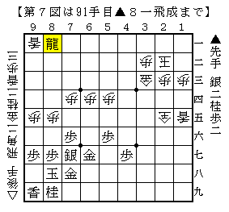
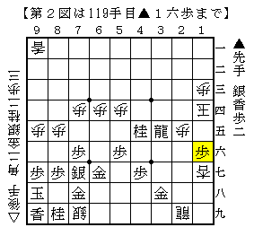
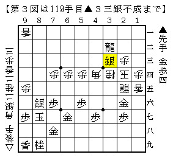
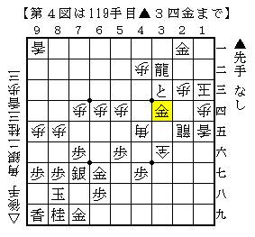
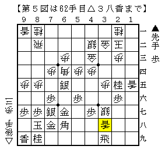
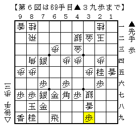

# [矢倉]Ponanza新手の意義４  

順位戦始まってしまいました。  
本当は始まる前に各クラスの展望とかこの棋士の将棋を見ろ！  
的な記事を書きたかったのだが、  
結局手をつけたもののどっちつかずになってしまった。。。  

今回は「どちらも自信がある戦い」の結末とその周辺について記したい。  

前回までで「９１手組」の成立過程について述べた。  
改めてその要点を述べると  

・先手はとにかく攻め駒、特に飛車を捌こうとしている  
・後手は飛車を押さえながら成銀を引きつけ、上部を厚くしようとしている  

という「どちらも自信がある展開」でのせめぎ合いをひたすら突き詰めていった結果  
「９１手組」に辿り着いたということである。  

問題はこの局面は先手勝ちなのか、それとも後手勝ちなのか。  
焦点は後手が上部に逃げ出し入玉できるかだ。  

その攻防が随分と研究され、実戦でも一時期集中して出現した。  

  

再掲「９１手組」図以下  
１）△２四歩  
▲屋敷△松尾（棋王）で出現。先手勝ち。  

  

２）△１四歩  
▲渡辺△三浦（棋王）で出現。先手勝ち。  

  

３）△４三金  
▲屋敷△渡辺（A級）で出現。先手勝ち。  

  

どうにも後手玉が捕まってしまう。  
特に最後の将棋は後手の渡辺竜王が３時間半も残して投了したことで話題となった。  

もちろんこの他に後手勝ちとなった将棋も存在したのだが、  
その後すぐに修正案が出て先手勝ちとなってしまう。  

そんなこんなで「９１手組」は先手勝ちではないかと現在は見られているのである。  

大本命が先手良しとなってしまった以上後手は別の手段を探さないといけない。  
一時期△２六銀成に代えて△３八香と打つ手が指されたこともあった。  

  

「香は下段から打て」という格言なんてまるで無視した一手だが、  
元は相手がフライングで捨ててくれた香だから惜しみなく使おうという意味。  

第１局は持将棋になり後手大成功。  
そこから屋敷九段が新手を出して羽生３冠を追い詰めるなど  
後手もやれると見られた時期もあったが、次の手が発見されて廃れてしまった。  

  

なんと素朴な手だろう。  
上段に香車を打ったためあっけなく死んでしまった。  
もちろん△３八香を打った時からどこかで打たれるのは織り込み済みのはずだが  
研究が進みこれで先手がやれるということになったのだ。  

こうして遂に矢尽き刀折れ、何年にも渡り続いた５４手目△３七銀の戦いは幕を閉じた。  

「積極的な受け」が上手くいかないと判明してしまったので  
前々回に紹介した銀冠作戦などが時折指されたが、  
やはり後手の勝率はあまり上がらず後手矢倉苦難の時代を予感させたのだ。  

そんな中で指されたのが名人戦第５局であり、Ponanza新手△３七銀である。  
これについて次回記したい。  
