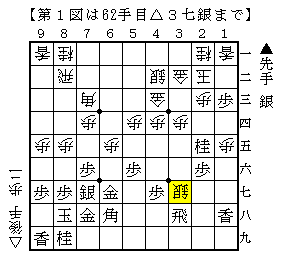
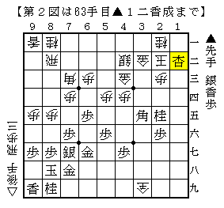
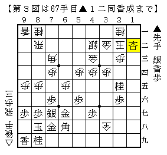

# [矢倉]Ponanza新手の意義５  

気付けば早５回目。  
自身の矢倉定跡見直しも兼ねている部分があるとはいえ、ねえ。。。  

最終回は筆者の考えるPonanzaの意義について。  

前回まで△９五歩型において宮田新手に如何に対抗してきたかを述べた。  
その初期の段階はともかく、ある時期から試みられた「積極的な受け」  
という方針の限界がとうとう来てしまったのである。  

しかし更に受け身になる銀冠作戦は破綻こそしていないが  
勝ちにくく勝率が上がっていないのは以前触れた通り。  
そこで最後に残された「攻め合い」に目を向けたのが  
Ponanza新手における大きな意義の一つである。  

そもそも駒組みにおける無駄を極限まで排した▲４六銀▲３七桂型に対して  
攻め合いに出るということ自体がなかなか上手く行かなかったという経緯がある。  

▲６四歩を△同歩～△６五歩とした将棋を第１回に紹介したが、  
それは先手の端攻めが強力で攻め合い負けするというのは既に記した通り。  

また宮田新手▲６五歩に△９三桂～△８五桂とした将棋も指されたが、  
▲６六銀～▲７五歩とＢ面攻撃を受けると攻め切るのは容易でない。  
渡辺竜王が七番勝負で採用したものの追随する棋士は全くと言っていい程居なかった。  

第21期竜王戦七番勝負第２局 - ▲羽生善治名人-△渡辺明竜王  
http://live.shogi.or.jp/ryuou/21/kifu/081030.html  

こういう事情があり、長い間後手側は受け回って勝負するものだと思われてきたのである。  
しかし時は流れ、研究が進んだ。  
△３七銀という新たな武器を発見し磨いてきた後手側は  
遂に攻め合いにもこれを転用したのである。  

  

しかし単純に転用したといってもやっている事は攻めながら受けにも回るということで  
一歩間違えればちぐはぐになり、構想が簡単に破綻しかねない。  

そもそもこの△３七銀という手自体がかなり際どいタイミングで指された手でもある。  
今までなら精々１五にいる程度だった１筋の先手の歩がこの場合だともう１三に居る。  
以前の見方であれば一目で駄目だとしたものだ。  

ところが検討してみるとこれが案外難しい。  
この辺りはNHKBSにおける渡辺竜王の解説が解りやすかった。それを要約すると  
>>  
  

（第１図以下▲１五香と走り）  
大抵こういう受けには飛車を見捨てて端から攻めて良しとしたもの。  
ところが第３回でも紹介した５４手目△３七銀の変化にて現れる第２図と比べると  
第３図は随分と後手が得をしている。  
第２図の結論は後手良しなので普通に考えてこの局面は後手が悪いはずがない。  
<<  
このように△３七銀の研究が進み技術が進歩した影響が現れ、  
先手側もただ単に端から攻めるだけでは上手く行かなくなってきたのだ。  

名人戦第５局の後にさされた▲森内△木村もそれを表す一つの例となった。  
森内名人が示した修正案▲５七角～▲６八飛は後手の拠点を緩和するなるほどの構想だが、  
それでもなお押したり引いたりの捻じり合いの将棋になったのである。  

それまでにありがちだった先手が攻め切るか、後手が受け切るかという将棋ではなく、  
盤全体における幅の広い戦いが繰り広げられる矢倉戦。  
Ponanza新手によってそのようなある種の「矢倉らしい」将棋が増えてくると筆者は予想している。  

まとめよう。  
Ponanza新手の発見によって  

・後手番であってもある程度の攻め合いが挑めるようになった。  
・ただ単に攻め合うだけではなく「責め」も交えることで戦い方の幅が広がった。  

ということが起きたのである。  

「９１手組」全盛の頃に、事前の研究だけで決まる将棋は面白く無いという声が  
アマだけでなくプロ側からも出た。  
もちろん「９１手組」自体はある一つの形を極限まで突き詰めたものであるので  
その価値は非常に高いのだが、それに対する批判ももっともなものである。  

Ponanza新手により相矢倉の幅が広がり、  
再び先後どちらも手探り状態に戻ることまであるかもしれない。  
即ちそれは研究偏重の流れに対して揺り戻しが来ることを意味する。  
この発見を契機に、相矢倉に斬新なアイデアが数多く生まれることを筆者は望んでやまない。  

【参考文献】  
・矢倉の急所（森内俊之）  
・将棋世界講座「これで矢倉は指せる」（木村一基）  
・順位戦中継棋譜、コメント  
・他多数の棋譜  
