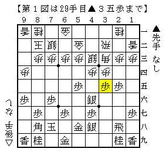
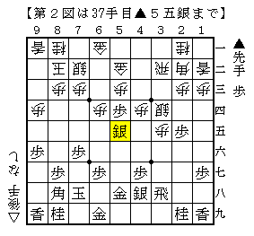
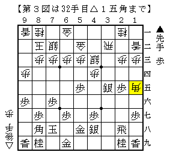
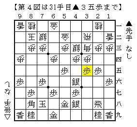

# [５筋位取り]藤井になれず１３  

くだらない矢倉の話をやったので四間飛車に戻りたい。  
本当は居飛穴周辺について触れたい点がいくつかあるのだが、  
２４をはじめとした実戦での経験がまだ少ない。  
もう少し熟成させてからの蔵出しとしたい。  

  

５筋位取りからの▲４六銀。  
部分的には王位戦リーグの▲牧野△藤井が類型としてあるが、  
どう考えてもそれと比べて振り飛車側の条件が良い。  

第５３期王位戦王位リーグ白組５回戦　藤井猛九段　対　牧野光則四段  
http://live.shogi.or.jp/oui/kifu/53/oui201205110301.html  

しかしここでもう１手指せるわけだが、何が得になる手なのかがさっぱり分からなかった。  
実戦は△６四歩としたが、これは特に利いているわけでもない。  

  

こうなってみるとまだまだ難しいとはいえ、振り飛車側がでかした感じはしない気がした。  

戻って最初の図では  

  

こうやるんですかね。  
▲３六歩に△４二角・△３四銀・△３四歩のどれが正解かよく分からないが。。。  

ただし仮にこれが正解だとしたところで、▲５七銀左△４三銀図から  
▲１六歩△１二香▲５五歩という順を経て第１図の類型の局面になった場合  
結局▲１六歩と△１四歩ないし△６四歩辺りの交換が入った局面になる。  

  

こうなると△１四歩も△６四歩もあまり利いていないのに対し  
▲１六歩は幽霊角を消しているので先手の方が得をしている感じがする。  

もしこれが成立するのであれば△４一金型にも使えるので、  
極めて優秀な仕掛けと言えるかもしれない代物になってしまう。  
見るからに嘘っぽくて胡散臭い感じがするのだが。。。  

（20130625追記）  
少し答えが見えてきた気がする。改めて記事にしたい。  
