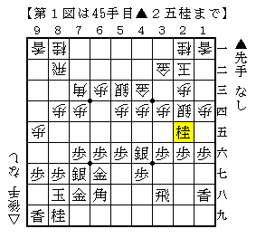
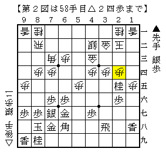
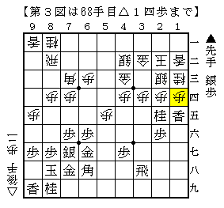
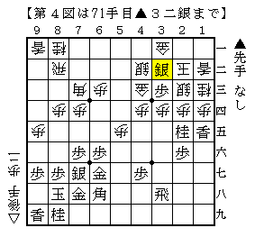
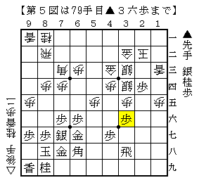

# [矢倉]K/U/M/I/A/W/A/S/E  

久々に自ら志向して相矢倉を指した。  
信頼出来る相手だったというのが一つ。そして待ち合わせの時間が（略  

  

先日のB2▲中田宏△島でも出てきた△９五歩型に単発▲２五桂。  
69期B1▲中田宏△畠山鎮で指された後に昨年２局立て続けに出現した。  

弊ブログでも以前ネタにしようとしたものの一切分からず断念した経緯がある。  
やはり実戦で汗をかいてみないと分からないものだ。  

ここで当然△４五歩と来るものだと思っていたのだが、ほぼノータイムで△４二銀。  
「これってアカンやつと違いましたっけ！？」  

  

５１３の仕掛けから△２四歩とされて初めて意図に気が付いた。  
うーんそうか、そういう組み合わせもあることはあるのか。  

  

通常型と違うのは５筋と６筋の関係。  
▲６六角と出ることが出来ないので▲４六角△４五歩の交換は損なはず。  
単に▲６八角と引いてどこかで▲４六角とぶつける方が大きいだろう。  

  

実戦はこう進んで△２五歩と桂を取ったので  
▲２三銀成～▲２四銀～▲１四香で一気に受けがなくなってしまった。  
代えて△１五歩と香の方を取られると自信のない進行。  

  

「矢倉の急所」の▲６八角と引く変化通りに進めるとこんな感じ。  
恐らく先手の方が得な形ではあると思うが、  
それが有意なほどの得かと言われると非常に難しい。  
