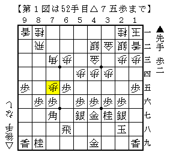
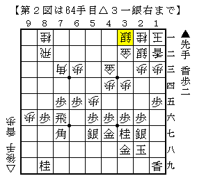
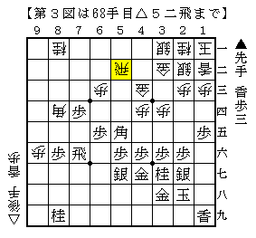

# [居飛穴]藤井になれず１４  

四間飛車の呼吸というものが少しは分かってきたものの、  
依然として素人の域を脱するには時間がかかりそうだ。  

  

NHK杯▲鈴木△渡辺で見たような仕掛け。  
普通は６六に銀がいるのでこの順はないのだが  
△８四角▲５七銀△７三角とオーバーランすることで銀の位置を変えている。  
今回も▲１五歩が欲張り過ぎだったようだ。  

  

十手ちょっと進んで第２図。  
仕掛けてから手を戻したが、こうなれば振り飛車まずまず以上といったところか。  

ここで▲５五歩と▲７四歩～▲５五角がどちらもありそうで迷ったのだが、  
改めて見るとこういう場面では強い人ほど焦らず▲５五歩としそうな気がする。  
実戦は▲７四歩△８四角▲５五角と強く捌きに出た。  
それに△５二飛として第３図。  

  

どう考えてもここは▲９一角成とすべきところ。  
それで完封ペースだったはずだ。  

ところが▲９一角成には△７五香が気になってしまった。  
以下▲６六飛△７八香成で飛車と桂が両取りで嫌な雰囲気かな、というものだが  
そんなものは▲７六飛と戻っておいて△８九成香▲８一馬でなんともない。  

そんな馬鹿げた勘違いがあり実戦は▲８五歩として飛車の可動域を広げたが、  
当然喜んで△５七角成～△５五飛と切り飛ばしてくる。  
折角の優勢を一気にフイにしてしまった。  

その後端から反撃するなどして難しい将棋が続いたが最後は秒に読まれて頓死負け。  
正しく受けていればまだ形勢自体はいい勝負だったようだが、  
端を攻めているとはいえガチガチ相手の互角では辛いものがある。  

やはりいくら良くなったところで、それを維持できないと勝つのは難しいのだ。  

（20130626追記）  
△３二金型なので△８四角に▲５七銀とすぐ受ける必要はなかった。  
ただしそれはそれで銀冠に組めるかというと微妙なところ。  
