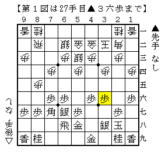
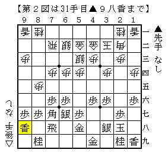
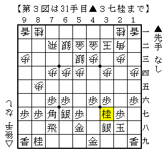

# [早仕掛け]K/U/M/I/A/W/A/S/E ２  

女流王座戦▲山根アマ△中倉宏は興味深い戦型になった。  

  

この▲３六歩はかなり強情な手。  
意地でも▲５六歩と突かないことで▲５六銀からの玉頭銀の含みを残し、  
とにかく早仕掛けは嫌ですよと盤上で声高に叫んでいる。  

これを咎めにいくのであれば△６四銀からの斜め棒銀は有力だった。  
対斜め棒銀では▲７八飛▲５六歩は必須、更に▲９八香も入るのが極めて望ましいが、  
明らかに▲９八香を指す猶予など無いまま戦いになる。  

大決戦になった際▲３六歩（玉が広くなる）と△４二金上（連結が良い）の２手が  
どちらによりポイントになるのか難しいところ。  
部分的には名著「定跡外伝」で触れられているが、筆者もよく分かっていないのが実情だ。  

実戦は△７二飛として阿久津流亜急戦に。（鷺宮定跡じゃないよねこれ）  
中継ブログにもあったように▲９八香が問題の一手だった。  

  

次の△６五歩を▲同歩と取れないとおかしいのだが、  
△８二飛▲６六角△４四銀▲８八飛△５五銀  
で打ったばかりの角が死んでしまう。  
序盤に▲５六歩と突かなかった弊害がこんなところに出てしまうのだ。  

かといって▲６六角と打てないようでは▲８八飛に△９九角。  
（筆者は先日うっかりこの筋を喰ってしまったばかりだ）  

結局▲５六歩とするしかなく、あれほど嫌だった早仕掛けに合流してしまった。  
それも価値の低い▲９八香という手を指した形で。  

気になったのは▲９八香に代えて▲３七桂ならどうだったかという点。  

  

△６五歩からの角交換～△８二飛は▲５七歩型なので△７九角の筋もなく  
▲８八飛と受けておいてなんともない。  

代わる手もせいぜい△６三銀ぐらいしか筆者には思いつかないのだが、  
▲４五桂△４四銀▲４七金と相当気持ちの良い利かしが入る。  
こうなっては後手は角も銀も活用する目処が全く立たない。  

仮にその筋が成立しなかったとしても角交換～△７九角～△４六角成が王手にならない。  
それだけでも十分大きいだろう。  

以上の点より振り飛車の模様が良いのでは、という気がする。  
