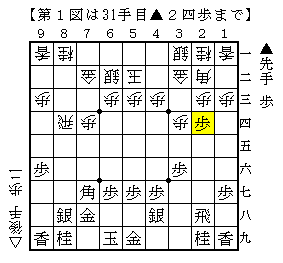
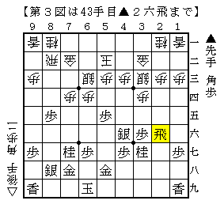
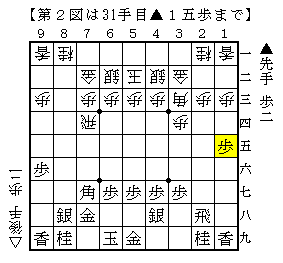
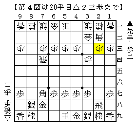
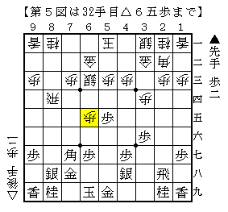

# [横歩取り]K/U/M/I/A/W/A/S/E ３  

順位戦B1▲高橋△豊島の一局に込められた意義は思いの外大きいようだ。  
まずは当の高橋先生の弁を引用させて頂く。  
>http://ameblo.jp/t-mitch142/entry-11562253848.html:title>  
それにしても20手で敗局を自覚する羽目になるとは・・・。  

個人的な視点では、21手目に苦しんで大長考しているようでは、いかんという事です。  
<<  
恥ずかしながら筆者は２１手目に長考していたということに気付いていなかった。  
完全に通り過ぎていた場所だっただけに、これらを目にした際には、  
またその意味が少しだけでも分かった際には驚きを超えて唖然としたものである。  

「先手番横歩取らせ」のポイントは３つある。  

１）△７二金△６二銀型の中住まいに後手の玉形を限定させる  
２）先手番で１手多く指せることによって更に後手の作戦を守備的なものに限定させる  
３）後手が守勢に回ったので十分な攻勢を得られる  

この三段論法が「先手番横歩取らせ」を成り立たせている、というのが筆者の考えだ。  
（高橋先生は「いや全然違うけど。」とおっしゃるかもしれないが。。。）  

70期A級▲高橋△谷川は２）でぶつかった。  

  

▲９六歩の一手がなければ△８五飛における超基本形の戦い。  
ところが端歩の違いが大きく、これが戦いの中で生きてくる。  
詳細は当該対局の応援掲示板にあるのでそちらを参照して欲しい。  

70期A級▲高橋△郷田は一応３）まで全て通った将棋となった。  

  

明らかに好みの分かれる駒組みだが  
▲３五歩の仕掛けだけでなく後の▲５四歩からの玉頭攻めもあり、意志は通っている。  
実際終盤に▲５四歩からの玉頭攻めが入り難しい形勢に。  

71期A級▲高橋△羽生も三つが全て通った将棋。  

  

△７四歩と突くと前述のように仕掛けられてまずいので  
△３三角～△４二銀と玉頭を厚くしたのが後手の工夫。  
そこで薄くなった１筋に狙いをつけて難しい戦いに。  

このように２）は甘受した上でどのように３）と向き合うかというのが  
これまでの後手の作戦のポイントであった。  
ところがそれに真っ正面から反発したのが豊島七段。  

  

この△２三歩が意表の一手。  
▲２二角成△同銀▲８三角があるので△７二金とするのが当然だと思われていた。  
これが前述の１）を成り立たせていたわけだが、それが崩れてしまったのだ。  

１）が崩れたということはそれに付随する２）も３）も同時に崩壊してしまう。  
▲高橋△豊島はそれが如実に現れた将棋だった。  

  

５筋位取りに対する居玉＋△６三銀＋△６五歩型が新機軸。  
▲５四歩や桂跳ねからの玉頭攻めを緩和しながら  
△６六歩と急所を攻めることが出来る。  

実戦では玉頭攻めを受けることなく△６六歩からの攻めをヒットさせるという  
後手の狙いが全て実現してしまった。  
改めて言うが△２三歩が通ってしまったがためにこうなったのだ。  

これだけ先手側の主張が粗方潰されてしまっては  
>>  
終わりにしちゃうかもしれません。  
<<  
と嘆き節も出ようものだ。  
横歩取り愛好者の筆者としては今後の高橋先生の動向が極めて気になっている。  

ところでどうして△２三歩に▲２二角成～▲８三角では駄目なのか  
現状筆者には分からないのですが一体どうするのでしょうかね。  
ここ一番重要なところなんですがねえ。  
