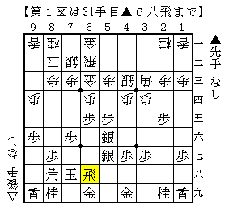
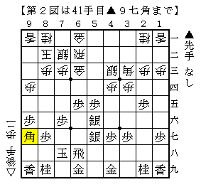
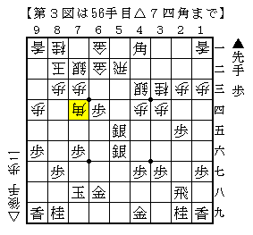
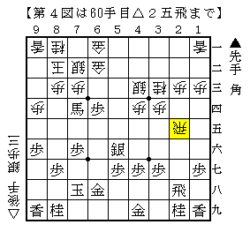
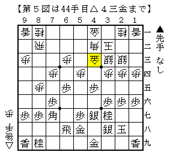
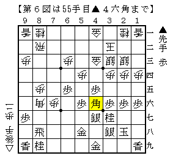

# [５筋位取り]藤井になれず１５  

何故か遠方の県代表や筆者の居住県で三本の指に入る強豪が  
筆者の地元にまで足を運んでくれたという不思議で幸運な週末だった。  

我が県超強豪の方との将棋は５筋位取りから▲６八飛という見慣れないものに。  

  

ここで△６五歩▲同銀△６四歩と大人しく収めておいて  
歩を切られたことと部分的な手得のバーターで一局では、と局後に教えて頂いた。  
以下一例は▲５六銀△２四歩▲２八飛△２二飛。  
亡くなられた全国強豪N氏との前例だとか。  

実戦は△５四歩と歩を切りに行ったことで流れが急になった。  

  

ちょっとこれでは振り飛車失敗。  
玉形以上に６筋を完全に押さえ込まれているのが大きそう。  

  

逃げているとジリ貧なので勝負手。  
以下▲５七歩△５五飛▲７四角成△２五飛と進む。  

  

こうなると少し挽回できた感じ。  

実戦はこの数手後に疑問手を指して形勢を損ね  
そのまま全駒ペースに入ったところで投了。  
格の差力の差をひしひしと感じた一局。  

一方で遠方の県代表の方との将棋は情けないものだった。  

  

普通に指した上図は既に作戦勝ち。  
ところがうっかり手が滑って▲４六銀と指してしまい全てがパー。  

代えて極々普通に▲５六歩としておけば△８六歩▲同歩△７五歩の仕掛けも  
▲７八飛△７六歩▲６八角△８六角▲８八飛△８五歩▲４六角  

  

が一例で振り飛車が指せる展開。  
残念ながら指している将棋が四間飛車ではなかったようだ。  
