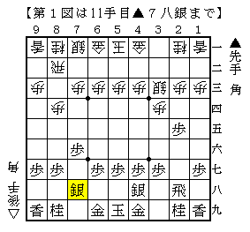
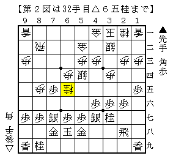
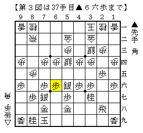
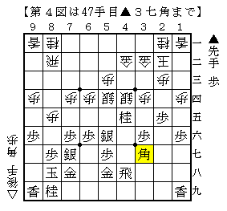
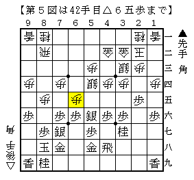
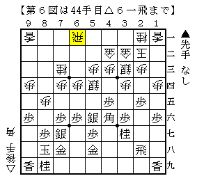

# [角換わり]K/U/M/I/A/W/A/S/E ４  

再び女流王座戦から▲本田△伊奈川より。  
本田女流三段は前期五番勝負でも３手目▲２五歩～角換わり腰掛け銀を指している。  

  

▲４八銀として△８四歩を誘い、左美濃と組み合わせたのが新たな工夫。  
思わず唸った。  

・△８五歩を強要できそう  
・▲７八銀型の天敵筋違い角がない  
・６手目が△２二銀△３二銀△４二銀のどれであっても同じ  

という利点があるからだ。  

△８五歩を決めなければ左美濃のまま決戦。  
類型の銀河戦▲深浦△中村太はひたすら攻め続ける展開に。  

  

実戦は受け間違いもあり後手勝ち。  
攻め切れるかどうかは微妙なところだが、かなりうるさい攻めに見える。  
少なくとも電王戦▲阿部光△習甦よりも良い条件下での仕掛けが期待できそう。  

これが嫌なら△８五歩を決めることになる。  
冒頭で述べた前期女流王座戦▲本田△加藤と比べると  
▲４七金と上がらなくていい分随分と先手の幅が広がった。  
以下一例として  

  

こうなって  

  

この局面に持ち込むことが出来れば先手としては相当。  
最近指されている形と比べて▲１八香と上がっていないだけだが、  
元を辿ればこちらの方が古くからある。  

以下△６二飛なら▲１五歩△同歩▲同香と進むので▲１八香が関係ない進行。  
△９二飛でも後の△６三角が香車に当たってこないなどむしろ得な面すらあるほどで  
形勢を大きく左右するほどの差にはならない。  

よって後手としては  

  

金の上がり方をずらしてこっちのコースを選ぶか  

  

こういう専守防衛を目指してどうか。  

最終的にはやはり▲２五歩と決めている分だけ損だという結論になりそうな予感もするが、  
損を小さくする余地は思った以上に大きいようだ。  
