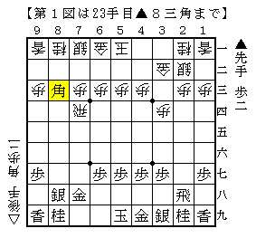
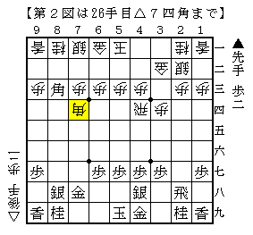
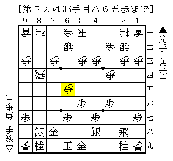
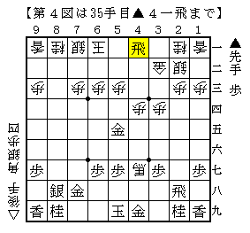

# [横歩取り]K/U/M/I/A/W/A/S/E ５  

またまた女流王座戦から▲千葉△中井より。  
書きたいネタは色々とあるところだが、これを外す訳にはいかない。  

  

やってくれました▲８三角。  
まさかこんなに早く実戦で現れるとは。。。  

  

ここから  

１）▲７四同角成△同飛▲６九玉  
２）▲６一角成△同玉▲５五金△４七飛成  

の２コースがあるのはショパン先生の検討にあった通り。  
当初は筆者も同様の見解であった。  

横歩取り 先手横歩取らせ▲２八飛型 豊島新手△２三歩  
http://ameblo.jp/shogi-strategy/entry-11565305152.html  

ところが改めて考えてみると、１）のコースを選んだところで何を目指すかが難しい。  

形は▲５五歩～▲５六銀として玉頭攻め狙いだが  
既に角交換しているので▲５六銀に△５七角がつきまとう。  

また中原囲いにするのも△５五角があるので▲３六歩とすぐには突けない。  
▲７七桂か▲５六歩として一旦防ぐ必要があるが、  
前者は引き飛車が祟り△７四歩～△７五歩が間に合って来るので駄目。  
よって▲５六歩だが▲高橋△豊島のように６筋を伸ばしてどうか。  

  

一番単純に進めるとこういう具合だが、これでも次の△６六歩が嫌味。  
最初の方での▲８八角成△同銀の交換がどうにも後手の得になっているように見える。  
単純に進めてもこうなので後手の工夫次第ではより厳しくなることも十分ありえるだろう。  

そういう事情があってかなくてか筆者には分からないが、実戦は激しく２）のコース。  

  

難しい気もするがやはり５五の金が気になる。  
２八の飛車もどう活用するのか当面目処が立たず、あまり先手を持ちたいとは思わない。  

高橋先生の６９分にも及ぶ長考の一端を垣間見ることが出来たかもしれない。  

（20140714追記）  
まさか丁度一年後にA級順位戦で指されることになろうとは・・・  
結果的には後手が勝ち、僅かに良いという結論になりそうではあるのだが  
アマチュア的に先手互角以上の局面はあったと思われる。  
