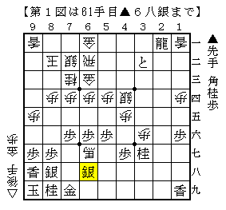
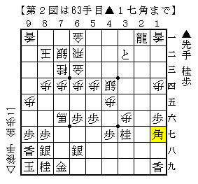
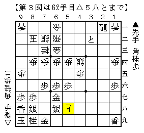
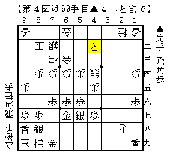

# [居飛穴]藤井になれず１６  

▲２六角型との戦いから。  
図はボロっと金を取った直後の局面。  

  

どの歩を取るかの三択。  
「振り飛車は７六の歩を取れ」の格言通り筆者は△７六馬としたのだが、  
もしかしたらこれはやや疑問だったかもしれない。  

  

この▲１七角が妙に受けにくくて驚いた。  
取ったばかりの金を打つしかないのではどうもおかしい。  
（とはいえまだしも打って頑張るべきだった。。。）  

△６六馬か△５六馬とすべきだったのではというのが感想戦での一応の結論。  
「よくわかる四間飛車」にもほぼ同一局面で△６六馬とする順が掲載されていた。  

もしくは戻って△４九角と打たずに△７三歩成もあるかもしれない。  
▲３二と△６二飛▲２一飛成△４七と▲６八銀△５八と  

  

こう進めば振り飛車もまずまずか。  

ところで我が家のBona先生にお伺いを立てたところ  
上記手順中△７三歩成▲３二との局面で△２八と▲４二とと  
飛車を取り合うべきと指摘されたのだが、本当にこれで振り飛車が良いのだろうか？  

  
