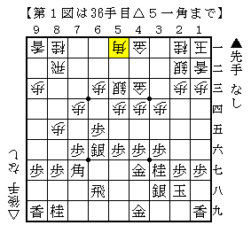
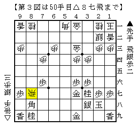

# [居飛穴]藤井になれず１７  

あくまで筆者の本業は横歩取りであったはずだが、  
「四間飛車激減の理由」ばかり読んでいるうちについていけなくなってしまった。  
どっちつかずの宙ぶらりんになってしまっている。。。  

  

先手四間飛車でありがちな図。  
阿部健本でもほぼ同じ図はあるが、それと比べて金が締まっていない。  
普通こういう局面だと仕掛けるしか無いと思うのだが。。  

  

<del>本と同様に進めるとここで困る。  
金が締まっていない分▲６一龍が角取りにならない。</del>  

（20130722追記）  
あさげさんご指摘の通り▲５五角として振り飛車が指せる。  

そこで実戦は▲６三飛成とせずに▲５五角～▲８八飛としたが、  
飛車を先着された下図は金が締まっていない分振り飛車にプラスでも  
将来△８四角の活用もあり大して自信のない局面だと感じた。  

  

▲６四歩と早めに突き捨てずに単純に▲５五銀～▲４五歩も考えられるが、  
結局△４二金引となるので言うほど大きな差が出ないというのが現状の認識。  
あまり咎めた感じがしない。  

細かい違いで成否が異なるというのはよくあることではあるが、  
仮にこの図ですら仕掛けられないとすれば  
ちょっとつまらないなという白けた感じがしなくもない。。  
